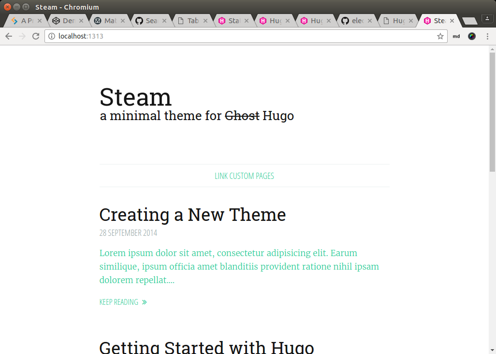
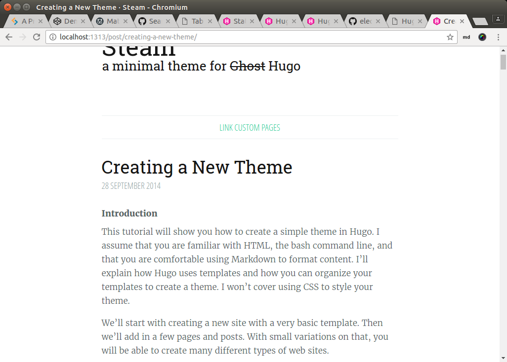
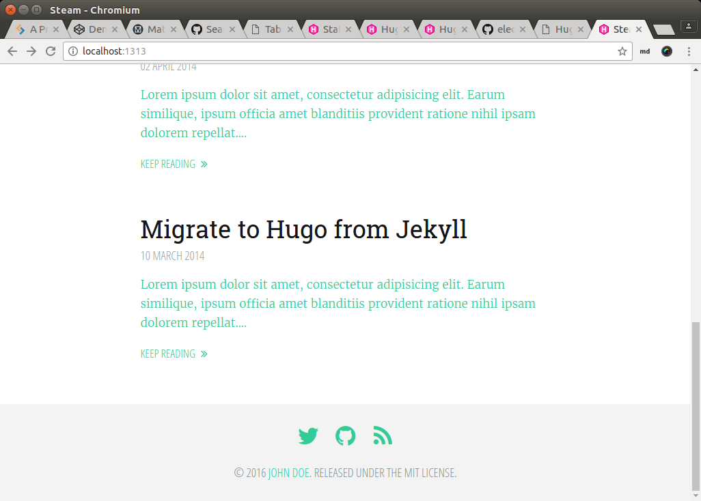
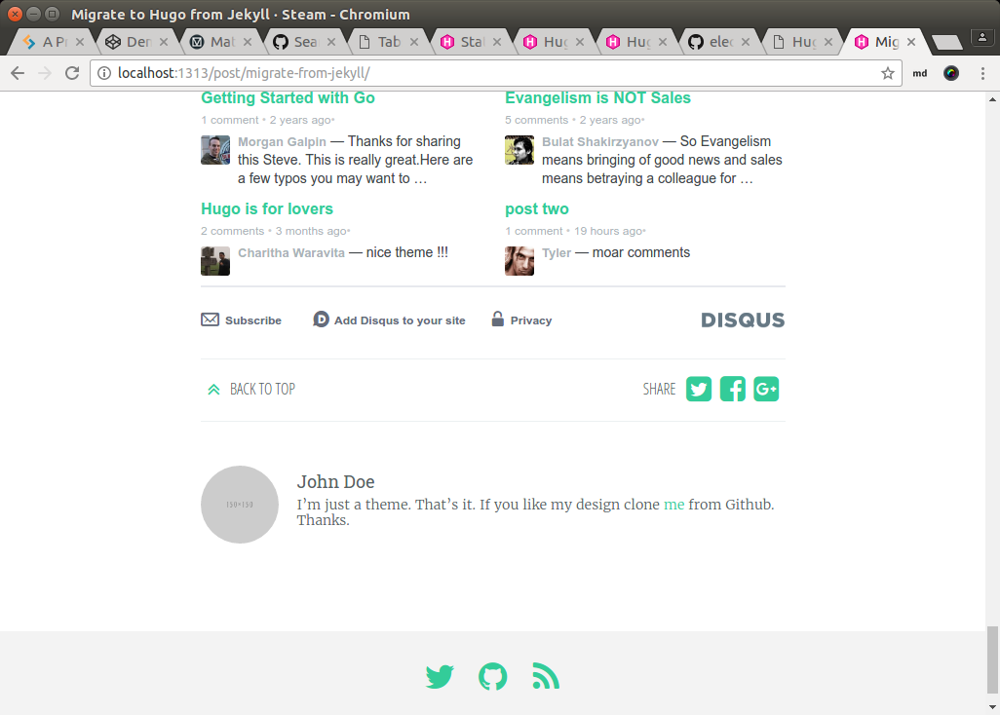

class: split-30 nopadding
background-image: url( bkgs/batu.jpg )

.column_t2.center[.vmiddle[
.figplaint[

]
]]
.column_t2[.vmiddle.nopadding[
.shadelightdark[.boxtitle1[
### Static Webpage Generator
# Hugo

### [Eueung Mulyana](https://github.com/eueung)
### https://eueung.github.io/112016/hugo
#### CodeLabs | [Attribution-ShareAlike CC BY-SA](https://creativecommons.org/licenses/by-sa/4.0/)
#### 
]]
]]

---
class: column_t1 middle

.fonth4[
.tabtype1.fullwidth[
| Outline  |
|:-------------:|
| Introduction |
| Quick Start |
| Notes |
]]

---
class: split-30 nopadding
background-image: url( bkgs/batu.jpg )

.column_t2.center[.vmiddle[
.figplaint[

]
]]
.column_t2[.vmiddle.nopadding[
.shadelightdark[.boxtitle1[
### 
# Introduction

### 
### 
#### 
#### 
]]
]]

---
class: split-60 nopadding 

.column_t1[.vmiddle.pushfront.right[
# What is Hugo?

Web site generators render content into HTML files. Most are "**dynamic** site generators". That means the HTTP server (which is the program running on your website that the user's browser talks to) runs the generator to create a new HTML file each and every time a user wants to view a page.

Hugo renders all HTML files on your computer. You can review the files before you copy them to the computer hosting the HTTP server. Since the HTML files aren't generated dynamically, we say that Hugo is a "**static** site generator".

Refs: [Introduction to Hugo](http://gohugo.io/overview/introduction/)

]]
.column_t2[.vmiddle[

.figplaint[

]

- Hugo is a general-purpose website framework
- Hugo is a **static** site generator
- A Fast and Flexible Static Site Generator built with love by [spf13](http://spf13.com/) and friends in [Go](https://golang.org/).


]]

---
class: split-70 nopadding 
background-image: url(images/staticgen.jpg)

.column_bt[.vmiddle.pushfront.right[

<br/><br/><br/><br/><br/><br/>

# Static Site Generators

The typical CMS driven website works by building each page on-demand, fetching content from a database and running it through a template engine. This means each page is **assembled** from templates and content on **each request** to the server.

A **Static Site Generator** takes a different approach and generate all the pages of the website once when there's actually changes to the site. 

This means there's no moving parts in the deployed website. Caching gets much easier, performance goes up and static sites are far more secure.

Ref: [StaticGen](https://www.staticgen.com/about)

]]
.column_t2[.vmiddle.right[

]]

---

class: column_t1  middle center

.figplaint[

]


---
class: column_t1  middle center


.fonth5[
Hugo is a static HTML and CSS website generator written in Go. It is optimized for speed, easy use and configurability. Hugo takes a directory with **content** and **templates** and .uline[renders] them into a full **HTML** website. <br/>

Hugo relies on **Markdown** files with .uline[front matter] for meta data. And you can run Hugo from any directory. This works well for shared hosts and other systems where you don't have a privileged account.<br/>

Hugo **renders** a typical website of moderate size in .uline[a fraction] of a second. A good rule of thumb is that each piece of content renders in around **1 millisecond**.<br/>

Hugo is designed to work well for .uline[any kind] of website including blogs, tumbles and docs. \[Ref: [spf13/hugo](https://github.com/spf13/hugo)\]
]

---
class: split-30 nopadding
background-image: url( bkgs/batu.jpg )

.column_t2.center[.vmiddle[
.figplaint[

]
]]
.column_t2[.vmiddle.nopadding[
.shadelightdark[.boxtitle1[
### 
# Quick Start

### 
### 
#### 
#### 
]]
]]

---
class: split-30 nopadding 

.column_t1[.vmiddle.pushfront.right[
# Step \#1
Download &amp; Install

# Step \#2
Scaffold A New Site

]]
.column_t2[.vmiddle[

```bash
*$ which hugo
/usr/bin/hugo
*$ hugo version
Hugo Static Site Generator v0.17 BuildDate: 2016-10-07T21:45:27+07:00

# ---

*$ hugo new site me.github.io
Congratulations! Your new Hugo site is created in "/home/em/now/hugo-work/me.github.io".

Just a few more steps and you're ready to go:

1. Download a theme into the same-named folder.
   Choose a theme from https://themes.gohugo.io/, or
   create your own with the "hugo new theme <THEMENAME>" command.
2. Perhaps you want to add some content. You can add single files
   with "hugo new <SECTIONNAME>/<FILENAME>.<FORMAT>".
3. Start the built-in live server via "hugo server".

Visit https://gohugo.io/ for quickstart guide and full documentation.
```

]]

---
class: split-70 nopadding 

.column_t2[.vmiddle.pushfront[

```bash
*$ cd me.github.io
*$ tree
.
--- archetypes
*--- config.toml
--- content
--- data
--- layouts
--- static
--- themes

6 directories, 1 file

# ---

*$ cd me.github.io/
*$ git clone https://github.com/digitalcraftsman/hugo-steam-theme.git themes/hugo-steam-theme

*$ cp -av themes/hugo-steam-theme/exampleSite/* .

*$ hugo server --watch
Started building sites ...
Built site for language en:
0 draft content, 0 future content, 0 expired content
*5 pages created, 0 non-page files copied
*10 paginator pages created, 2 categories created, 6 tags created
total in 66 ms, Watching for changes in /home/em/now/hugo-work/me.github.io/{data,content,layouts,static,themes}
Serving pages from memory
*Web Server is available at http://localhost:1313/ (bind address 127.0.0.1)
Press Ctrl+C to stop

```

]]
.column_t1[.vmiddle[

# Step \#3
Select &amp; Download A Theme

# Step \#4
Copy `exampleSite` &amp; Run

]]

---
class: column_t1  middle center

### localhost:1313

.figstyle1[

]

---
class: split-30 nopadding 

.column_t1[.vmiddle.pushfront.right[

# Content 
#### &amp;
# config.toml

]]
.column_t2[.vmiddle[

```bash
*$ tree
.
--- archetypes
*--- config.toml
*--- content
------- about
*----------- index.md
------- post
*----------- creating-a-new-theme.md
*----------- goisforlovers.md
*----------- hugoisforlovers.md
*----------- migrate-from-jekyll.md
--- data
--- layouts
--- static
--- themes
------- hugo-steam-theme
----------- ...

```

]]

---
class: split-70 nopadding 

.column_t2[.vmiddle.pushfront[

### post/creating-a-new-theme.md

```markdown
*---
author: "Michael Henderson"
*date: 2014-09-28
linktitle: Creating a New Theme
next: /tutorials/github-pages-blog
prev: /tutorials/automated-deployments
*title: Creating a New Theme
weight: 10
*description: "Lorem ipsum dolor sit amet, consectetur adipisicing elit. Earum similique, ipsum officia amet blanditiis provident ratione nihil ipsam dolorem repellat."
*---


### **Introduction**

This tutorial will show you how to create a simple theme in Hugo. I assume that you are familiar with HTML, the bash command line, and that you are comfortable using Markdown to format content. I'll explain how Hugo uses templates and how you can organize your templates to create a theme. I won't cover using CSS to style your theme.

We'll start with creating a new site with a very basic template. Then we'll add in a few pages and posts. With small variations on that, you will be able to create many different types of web sites.

...

```

]]
.column_t1[.vmiddle[

# Example Post

]]

---
class: split-30 nopadding 

.column_t1[.vmiddle.pushfront.right[

# Example Page

]]
.column_t2[.vmiddle[

### about/index.md

```markdown
*+++
*date  = "2015-08-22"
*title = "Link custom pages"
*menu  = "main"
*+++

You can add custom pages like this by adding `menu = "main"` in the frontmatter:

'''toml
+++
date  = "2015-08-22"
title = "About me"
menu  = "main"
+++
'''

This site is just a usual document. Create a new subfolder in `content` and name this document `index.md`. For example, I'm located under `content/about/index.md` to add indicate the subsection `/about` in the URL. 

But you can also link posts that way without moving them.

If no document contains `menu = "main"` in the frontmatter the navigation will not be shown. Sounds easy, right?

```

]]

---

class: column_t1  middle center

### Rendering Homepage/List

.figstyle1[

]

---

class: column_t1  middle center

### Rendering Single

.figstyle1[

]

---
class: split-70 nopadding 

.column_t2[.vmiddle.pushfront[

```toml
baseurl = "https://example.org/"
languageCode = "en-us"
*title = "Steam - a minimal theme for Hugo"
*theme = "hugo-steam-theme"
disqusShortname = "spf13"
paginate = 10

*[params]
  title = "Steam"
  subtitle = "a minimal theme for ~~Ghost~~ Hugo"
  copyright = "Released under the MIT license."

  themeColor = "green"
  googleAnalytics = ""

  name = "John Doe"
  bio = "I'm just a theme. That's it. If you like my design clone [me](//github.com/digitalcraftsman/hugo-steam-theme) from Github. Thanks."
  description = "Your description of the blog"
  location = "" # optional
  twitter = "spf13" # optional
  github = "spf13" # optional
  gitlab = "" # optional

  comments = "disqus"

  keepReadingStr = "Keep reading"
  backtotopStr = "Back to top"
  shareStr = "Share"
  pageNotFoundTitle = "404 - Page not found"
```

]]
.column_t1[.vmiddle[

# config.toml

]]

---

class: column_t1  middle center

### Rendering - Example

.figstyle1[

]


---

class: column_t1  middle center

### Rendering - Example

.figstyle1[

]


---
class: split-50 nopadding 

.column_t1[.vmiddle[

# Version Control 

```bash
# source version control

*$ git init
*$ echo "/public/" >> .gitignore
*$ echo "/themes/" >> .gitignore
$ echo "/others-if-any/" >> .gitignore
$ cat .gitignore
```

]]
.column_t2[.vmiddle.pushfront[

# Publish (GHP)

```bash
# create new GHP repo me.github.io (without readme)
*$ cd public/
*$ [sudo] git init
*$ [sudo] git remote add origin git@github.com:me/me.github.io.git
$ [sudo] git add .
$ [sudo] git commit -am "add disqus"
$ [sudo] git push --set-upstream origin master

# repo ghp
$ git checkout -b gh-pages
$ git push -f origin gh-pages
```

]]

---
class: split-30 nopadding
background-image: url( bkgs/batu.jpg )

.column_t2.center[.vmiddle[
.figplaint[

]
]]
.column_t2[.vmiddle.nopadding[
.shadelightdark[.boxtitle1[
### 
# Notes

### 
### 
#### 
#### 
]]
]]

---
class: split-30 nopadding 

.column_t1[.vmiddle.pushfront.right[

# Dockerfile 

]]
.column_t2[.vmiddle[

```dockerfile
FROM alpine:3.4
MAINTAINER EM <eueung@gmail.com>

ENV HUGO_VERSION=0.17 

RUN apk add --update wget ca-certificates && \
  cd /tmp/ && \
  wget https://github.com/spf13/hugo/releases/download/v${HUGO_VERSION}/hugo_${HUGO_VERSION}_linux-64bit.tar.gz && \
  tar xzf hugo_${HUGO_VERSION}_linux-64bit.tar.gz && \
  rm -r hugo_${HUGO_VERSION}_linux-64bit.tar.gz && \
  mv hugo_${HUGO_VERSION}_linux_amd64/hugo_${HUGO_VERSION}_linux_amd64 /usr/bin/hugo && \
  apk del wget ca-certificates && \
  rm /var/cache/apk/*

WORKDIR /work

CMD /usr/bin/hugo 
```

]]

---
class: split-30 nopadding 

.column_t1[.vmiddle.pushfront.right[

# Hugo on Docker 

]]
.column_t2[.vmiddle[

```bash

*$ docker build -t eueung/hugo:v2 .
*$ docker images | grep hugo
*$ docker login
*$ docker push eueung/hugo:v2
The push refers to a repository [docker.io/eueung/hugo]
11c97b295820: Pushed 
d4546b2b59fd: Pushed 
011b303988d2: Layer already exists 
v2: digest: sha256:764e9f134ad736fc67e29f4af136e523b557449562c3016ede3a456b7ace5ad7 size: 945


*$ docker run -ti --rm -v $(pwd):/work eueung/hugo:v2

*$ docker run -ti --rm eueung/hugo:v2 sh
*$ docker run -ti --rm eueung/hugo:v2 hugo version
Hugo Static Site Generator v0.17 BuildDate: 2016-10-07T14:45:27Z

```

]]


---
class: split-30 nopadding
background-image: url( bkgs/batu.jpg )

.column_t2.center[.vmiddle[
.figplaint[

]
]]
.column_t2[.vmiddle.nopadding[
.shadelightdark[.boxtitle1[
### 
# Refs

### 
### 
#### 
#### 
]]
]]

---
# Refs
.fonth5[
1. [Top Open-Source Static Site Generators - StaticGen](https://www.staticgen.com/)
1. [Hugo :: A fast and modern static website engine](http://gohugo.io/)
1. [spf13/hugo: A Fast and Flexible Static Site Generator built with love in GoLang](https://github.com/spf13/hugo)
1. [Hugo Themes Site](http://themes.gohugo.io/)
]

---
class: split-30 nopadding
background-image: url( bkgs/batu.jpg )

.column_t2.center[.vmiddle[
.figplaint[

]
]]
.column_t2[.vmiddle.nopadding[
.shadelightdark[.boxtitle1[
### 
# END

### [Eueung Mulyana](https://github.com/eueung)
### https://eueung.github.io/112016/hugo
#### CodeLabs | [Attribution-ShareAlike CC BY-SA](https://creativecommons.org/licenses/by-sa/4.0/)
#### 
]]
]]


