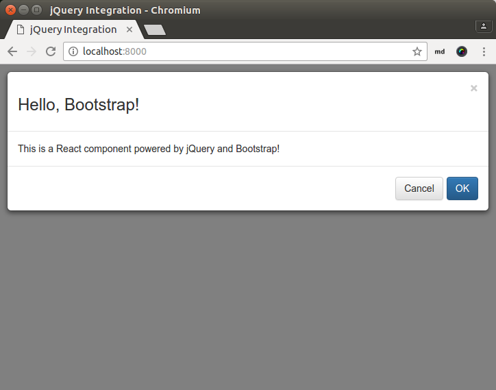

class: split-40 nopadding
background-image: url( bkgs/batu.jpg )

.column_t2.center[.vmiddle.pushfront[
.figplaint-maxh450.opacity7[

]
]]
.column_t2.shadelightdark.add-left-border.pushfront[.vmiddle.nopadding[
.boxtitle4[
### Looking at the Codes
# .fsize95[React .yellow[Examples]]

### [Eueung Mulyana](https://github.com/eueung)
### https://eueung.github.io/112016/react-exp
#### CodeLabs | [Attribution-ShareAlike CC BY-SA](https://creativecommons.org/licenses/by-sa/4.0/)
#### 
]
]]
---
class: column_t1 middle center

#React Version: **15.4.1**

.fonth5[Part 1 - Basic Examples: **https://eueung.github.io/112016/react-cont**<br/>Introduction to React already covered here: **https://eueung.github.io/112016/react** ]


---
class: column_t1 middle

.fonth4[
.tabtype1.fullwidth[
| Outline   |
|:-------------:|
|Starter Kit - Cnt'd|
|React Bootstraped|


]]

---
class: split-30 nopadding
background-image: url( bkgs/batu.jpg )

.column_t2.center[.vmiddle[
.figplaint-maxh550.opacity7[

]
]]
.column_t2[.vmiddle.nopadding[
.shadelightdark[.boxtitle1[
### 
# .fsize85[Starter Kit - Cnt'd]

### 
### 
#### 
#### 
]]
]]
---
class: split-40 nopadding 

.column_t1[.vmiddle.pushfront.right[

#Structure


]]
.column_t2[.vmiddle.pushfront.defaultalign[


```bash
*react-15.4.1$ tree -L 2
.
|-- build
|------ react-dom-fiber.js
|   |-- react-dom-fiber.min.js
|   |-- react-dom.js
|   |-- react-dom.min.js
|   |-- react-dom-server.js
|   |-- react-dom-server.min.js
|   |-- react.js
|   |-- react.min.js
|   |-- react-with-addons.js
|   |-- react-with-addons.min.js
|-- examples
|   |-- basic
|   |-- basic-click-counter
|   |-- basic-commonjs
|   |-- basic-jsx
|   |-- basic-jsx-external
|   |-- basic-jsx-harmony
|   |-- basic-jsx-precompile
|   |-- fiber
|   |-- jquery-bootstrap
*|   |-- jquery-mobile
*|   |-- quadratic
|   |-- README.md
|   |-- shared
*|   |-- transitions
*|   |-- webcomponents
|-- README.md

```


]]


---
class: split-70 nopadding 

.column_t2[.vmiddle.pushfront.defaultalign[


```html
<!DOCTYPE html>
<html>
  <head>
    <meta charset="utf-8">
    <title>Quadratic Formula Calculator</title>
    <link rel="stylesheet" href="../shared/css/base.css" />
  </head>
  <body>
    <h1>Quadratic Formula Calculator</h1>
    <div id="container">
      <p>
        If you can see this, React is <strong>not</strong> working right. This is probably because you&apos;re viewing
        this on your file system instead of a web server. Try running
        <pre>
          python -m SimpleHTTPServer
        </pre>
        and going to <a href="http://localhost:8000/">http://localhost:8000/</a>.
      </p>
    </div>
    <h4>Example Details</h4>
    <p>This is written with JSX in a separate file and transformed in the browser.</p>
    <p>
      Learn more about React at
      <a href="https://facebook.github.io/react" target="_blank">facebook.github.io/react</a>.
    </p>
*   <script src="../../build/react.js"></script>
*   <script src="../../build/react-dom.js"></script>
*   <script src="https://cdnjs.cloudflare.com/ajax/libs/babel-core/5.8.24/browser.min.js"></script>
*   <script type="text/babel" src="example.js"></script>
  </body>
</html>
```


]]
.column_t1[.vmiddle.pushfront.defaultalign[

#quadratic


.fonth5[HTML]


]]


---
class: split-70 nopadding 

.column_t2[.pushfront.defaultalign[


.fullcode[

```javascript
var QuadraticCalculator = React.createClass({
* getInitialState: function() {
    return {
      a: 1,
      b: 3,
      c: -4
    };
  },

  /**
   * This function will be re-bound in render multiple times. Each .bind() will
   * create a new function that calls this with the appropriate key as well as
   * the event. The key is the key in the state object that the value should be
   * mapped from.
   */
* handleInputChange: function(key, event) {
    var partialState = {};
    partialState[key] = parseFloat(event.target.value);
    this.setState(partialState);
  },

  render: function() {
*   var a = this.state.a;
*   var b = this.state.b;
*   var c = this.state.c;
    var root = Math.sqrt(Math.pow(b, 2) - 4 * a * c);
    var denominator = 2 * a;
    var x1 = (-b + root) / denominator;
    var x2 = (-b - root) / denominator;
    return (
      <div>
        <strong>
          <em>ax</em><sup>2</sup> + <em>bx</em> + <em>c</em> = 0
        </strong>
        <h4>Solve for <em>x</em>:</h4>
        <p>
          <label>
*           a: <input type="number" value={a} onChange={this.handleInputChange.bind(null, 'a')} />
          </label>
          <br />
          <label>
*           b: <input type="number" value={b} onChange={this.handleInputChange.bind(null, 'b')} />
          </label>
          <br />
          <label>
*           c: <input type="number" value={c} onChange={this.handleInputChange.bind(null, 'c')} />
          </label>
          <br />
          x: <strong>{x1}, {x2}</strong>
        </p>
      </div>
    );
  }
});

ReactDOM.render(
  <QuadraticCalculator />,
  document.getElementById('container')
);
```
]


]]
.column_t1[.vmiddle.pushfront.defaultalign[

#quadratic


.fonth5[JS+.yellow[JSX]<br/>.yellow[Requires **babel**]<br/>]
<br/>**render**<br/>**this.state**<br/>.yellow[Multi-Element]<br/>`...bind()`


]]


---
class: split-70 nopadding 

.column_bt[.vmiddle.pushfront.defaultalign[


.figplaint[

]


]]
.column_t1[.vmiddle.pushfront.defaultalign[

#quadratic


.fonth5[One Component]


]]


---
class: split-70 nopadding 

.column_t2[.pushfront.defaultalign[


.fullcode[

```html
<!DOCTYPE html>
<html>
  <head>
    <meta charset="utf-8">
    <title>Basic Example with WebComponents</title>
    <link rel="stylesheet" href="../shared/css/base.css" />
  </head>
  <body>
    <h1>Basic Example with WebComponents</h1>
    <div id="container">
      <p>
        To install React, follow the instructions on
        <a href="http://www.github.com/facebook/react/">GitHub</a>.
      </p>
      <p>
        If you can see this, React is <strong>not</strong> working right.
        If you checked out the source from GitHub make sure to run <code>grunt</code>.
      </p>
    </div>
    <br /><br />
    <h4>Example Details</h4>
    <p>
        This example demonstrates WebComponent/ReactComponent interoperability
        by rendering a ReactComponent, which renders a WebComponent, which renders
        another ReactComponent in the WebComponent's shadow DOM.
    <p>
    <p>
      Learn more about React at
      <a href="http://facebook.github.io/react" target="_blank">facebook.github.io/react</a>.
    </p>
*   <script src="https://cdnjs.cloudflare.com/ajax/libs/webcomponentsjs/0.7.21/webcomponents.js"></script>
    <script src="../../build/react.js"></script>
    <script src="../../build/react-dom.js"></script>
*   <script src="https://cdnjs.cloudflare.com/ajax/libs/babel-core/5.8.24/browser.min.js"></script>

    <script type="text/babel">
      // Define WebComponent
      var proto = Object.create(HTMLElement.prototype, {
*       attachedCallback: {
*         value: function() {
            var mountPoint = document.createElement('span');
            this.createShadowRoot().appendChild(mountPoint);

            var name = this.getAttribute('name');
            var url = 'https://www.google.com/search?q=' + encodeURIComponent(name);
*           ReactDOM.render(<a href={url}>{name}</a>, mountPoint);
          }
        }
      });
      document.registerElement('x-search', {prototype: proto});

      // Define React Component
      class HelloMessage extends React.Component {
        render() {
*         return <div>Hello <x-search name={this.props.name} />!</div>;
        }
      }

      // Mount React Component (which uses WebComponent which uses React)
      var container = document.getElementById('container');
*     ReactDOM.render(<HelloMessage name="Jim Sproch" />, container);
    </script>
  </body>
</html>
```
]


]]
.column_t1[.vmiddle.pushfront.defaultalign[

.fonth4[**webcomponents**]


.fonth5[HTML<br/>ES2015+.yellow[JSX]<br/>.yellow[Requires **babel**]<br/>]
<br/>**this.props.name**


]]


---
class: split-70 nopadding 

.column_bt[.vmiddle.pushfront.defaultalign[


.figplaint[

]


]]
.column_t1[.vmiddle.pushfront.defaultalign[

.fonth4[**webcomponents**]


.fonth5[One Component]


]]


---
class: split-70 nopadding 

.column_t2[.pushfront.defaultalign[


.fullcode[

```html
<!DOCTYPE html>
<html>
  <head>
    <meta charset="utf-8">
    <title>Example with Transitions</title>
    <link rel="stylesheet" href="../shared/css/base.css" />
    <link rel="stylesheet" href="transition.css" />
  </head>
  <body>
    <h1>Example with Transitions</h1>
    <div id="container">
      <p>
        To install React, follow the instructions on
        <a href="https://github.com/facebook/react/">GitHub</a>.
      </p>
      <p>
        If you can see this, React is <strong>not</strong> working right.
        If you checked out the source from GitHub make sure to run <code>grunt</code>.
      </p>
    </div>
    <h4>Example Details</h4>
    <p>This is written with JSX and transformed in the browser.</p>
    <p>
      Learn more about React at
      <a href="https://facebook.github.io/react" target="_blank">facebook.github.io/react</a>.
    </p>
*   <script src="../../build/react-with-addons.js"></script>
    <script src="../../build/react-dom.js"></script>
    <script src="https://cdnjs.cloudflare.com/ajax/libs/babel-core/5.8.24/browser.min.js"></script>
    <script type="text/babel">
*     var CSSTransitionGroup = React.addons.CSSTransitionGroup;
      var INTERVAL = 2000;

      var AnimateDemo = React.createClass({
*       getInitialState: function() {
*         return {current: 0};
*       },

        componentDidMount: function() {
          this.interval = setInterval(this.tick, INTERVAL);
        },

        componentWillUnmount: function() {
          clearInterval(this.interval);
        },

*       tick: function() {
*         this.setState({current: this.state.current + 1});
*       },

        render: function() {
          var children = [];
          var pos = 0;
          var colors = ['red', 'gray', 'blue'];
          for (var i = this.state.current; i < this.state.current + colors.length; i++) {
*           var style = {
*             left: pos * 128,
*             background: colors[i % colors.length]
            };
            pos++;
*           children.push(<div key={i} className="animateItem" style={style}>{i}</div>);
          }
          return (
            <CSSTransitionGroup
*             className="animateExample"
              transitionEnterTimeout={250}
              transitionLeaveTimeout={250}
              transitionName="example">
*             {children}
            </CSSTransitionGroup>
          );
        }
      });

      ReactDOM.render(
        <AnimateDemo />,
        document.getElementById('container')
      );
    </script>
  </body>
</html>
```
]


]]
.column_t1[.vmiddle.pushfront.defaultalign[

.fonth4[**transitions**]


.fonth5[HTML<br/>JS+.yellow[JSX]<br/>.yellow[Requires **babel**]<br/>..addons.js]
<br/><br/>**this.state.current**


]]


---
class: split-70 nopadding 

.column_t2[.pushfront.defaultalign[


.fullcode[

```css
.example-enter,
.example-leave {
  -webkit-transition: all .25s;
  transition: all .25s;
}

.example-enter,
.example-leave.example-leave-active {
  opacity: 0.01;
}

.example-enter.example-enter-active,
.example-leave {
  margin-left: 0;
  opacity: 1;
}
/* ------------------------------ */
.example-leave.example-leave-active {
  margin-left: -128px;
}

.example-enter {
  margin-left: 128px;
}
/* ------------------------------ */

*.animateExample {
  display: block;
  height: 128px;
* position: relative;
  width: 384px;
}

*.animateItem {
  color: white;
  font-size: 36px;
  font-weight: bold;
  height: 128px;
  line-height: 128px;
* position: absolute;
  text-align: center;
  -webkit-transition: all .25s; /* TODO: make this a move animation */
  transition: all .25s; /* TODO: make this a move animation */
  width: 128px;
}
```
]


]]
.column_t1[.vmiddle.pushfront.defaultalign[

.fonth4[**transitions**]


.fonth5[Global CSS]
<br/><br/>Inline Style provided by the Component


]]


---
class: split-70 nopadding 

.column_t2[.vmiddle.pushfront.defaultalign[


.figplaint[

]


]]
.column_t1[.vmiddle.pushfront.defaultalign[

.fonth3[**Layout**]


.fonth5[]


]]


---
class: split-70 nopadding 

.column_t2[.vmiddle.pushfront.defaultalign[


.figplaint[

]


]]
.column_t1[.vmiddle.pushfront.defaultalign[

.fonth4[**Enter &amp; Leave**]


.fonth5[]


]]


---
class: split-70 nopadding 

.column_bt[.vmiddle.pushfront.defaultalign[


.figplaint[

]


]]
.column_t1[.vmiddle.pushfront.defaultalign[

.fonth4[**transitions**]


.fonth5[One Component]


]]


---
class: split-70 nopadding 

.column_t2[.vmiddle.pushfront.defaultalign[


```html
<!doctype html>
<html lang="en">
<head>
  <meta charset="utf-8">
  <meta http-equiv="X-UA-Compatible" content="IE=edge,chrome=1">
  <meta name="viewport" content="width=device-width, initial-scale=1">
  <title>jQuery Mobile React Example</title>
* <link rel="stylesheet" href="https://cdnjs.cloudflare.com/ajax/libs/jquery-mobile/1.4.5/jquery.mobile.min.css" />
* <link rel="stylesheet" href="https://demos.jquerymobile.com/1.4.5/_assets/css/jqm-demos.css" />
</head>
<body class="ui-mobile-viewport ui-overlay-a">
  <div id="content"></div>
* <script src="http://code.jquery.com/jquery-2.2.2.min.js"></script>
* <script src="https://cdnjs.cloudflare.com/ajax/libs/jquery-mobile/1.4.5/jquery.mobile.min.js"></script>
  <script src="../../build/react.js"></script>
  <script src="../../build/react-dom.js"></script>
* <script src="js/app.js"></script>
</body>
</html>
```


]]
.column_t1[.vmiddle.pushfront.defaultalign[

#jquery-mobile


.fonth5[HTML]


]]


---
class: split-70 nopadding 

.column_t2[.pushfront.defaultalign[


.fullcode[

```javascript
/**
  * jQuery Mobile React Example
  *
  * Main application script.
  * For variety, this example is written in 100% JSHint-compliant JavaScript, not in JSX.
  *
  * Component structure:
  *
  * - App
* *   |-- JQueryMobilePage (one)
  *   |   |-- JQueryMobileHeader
  *   |   |-- JQueryMobileContent
  *   |   |   |-- PageOneContent
  *   |   |       |-- JQueryMobileButton
  *   |   |-- JQueryMobileFooter
* *   |-- JQueryMobilePage (two)
  *   |   |-- JQueryMobileHeader
  *   |   |-- JQueryMobileContent
  *   |   |   |-- PageTwoContent
  *   |   |       |-- JQueryMobileButton
  *   |   |-- JQueryMobileFooter
* *   |-- JQueryMobilePage (popup)
  *       |-- JQueryMobileHeader
  *       |-- JQueryMobileContent
  *       |   |-- PagePopUpContent
  *       |       |-- JQueryMobileButton
  *       |-- JQueryMobileFooter
 */

 /* global document, React */

'use strict';

*/** Main application component. */
*var App = React.createClass({
  displayName: 'App',

  render: function() {
    return React.DOM.div({className:'app'},
*     JQueryMobilePage({id:'one'}, PageOneContent(null)),
*     JQueryMobilePage({id:'two'}, PageTwoContent(null)),
*     JQueryMobilePage({id:'popup', headerTheme:'b'}, PagePopUpContent(null))
    );
  }
});
App = React.createFactory(App);

*/** jQuery Mobile page component. */
*var JQueryMobilePage = React.createClass({
  displayName: 'JQueryMobilePage',

  getDefaultProps: function() {
    return {'data-role':'page', 'data-theme':'a', headerTheme:'a'};
  },

  render: function() {
    var props = {};
    for (var key in this.props) {
      props[key] = this.props[key];
    }
    return React.DOM.div(props,
*     JQueryMobileHeader({title:'Page ' + this.props.id, headerTheme:this.props.headerTheme}),
*     JQueryMobileContent(null, this.props.children),
*     JQueryMobileFooter(null)
    );
  }
});
JQueryMobilePage = React.createFactory(JQueryMobilePage);

// Render application.
ReactDOM.render(App(null), document.getElementById('content'));
```
]


]]
.column_t1[.vmiddle.pushfront.defaultalign[

.fonth4[**jquery-mobile**]


.fonth5[JS]
<br/><br/>**this.props**<br/>.yellow[**this.props.children**]


]]


---
class: split-70 nopadding 

.column_t2[.pushfront.defaultalign[


.fullcode[

```javascript
*/** jQuery Mobile button component. */
*var JQueryMobileButton = React.createClass({
  displayName: 'JQueryMobileButton',

  getDefaultProps: function() {
    return {className:'ui-btn ui-shadow ui-corner-all'};
  },

  render: function() {
    return React.DOM.p(null,
      React.DOM.a(this.props, this.props.children)
    );
  }
});
JQueryMobileButton = React.createFactory(JQueryMobileButton);

*/** jQuery Mobile page content component. */
*var JQueryMobileContent = React.createClass({
  displayName: 'JQueryMobileContent',

  render: function() {
    return React.DOM.div({role:'main', className:'ui-content'},
      this.props.children
    );
  }
});
JQueryMobileContent = React.createFactory(JQueryMobileContent);

*/** jQuery Mobile footer component. */
*var JQueryMobileFooter = React.createClass({
  displayName: 'JQueryMobileFooter',

  render: function() {
    return React.DOM.div({'data-role':'footer'},
      React.DOM.h4(null, 'Page footer')
    );
  }
});
JQueryMobileFooter = React.createFactory(JQueryMobileFooter);

*/** jQuery Mobile header component. */
*var JQueryMobileHeader = React.createClass({
  displayName: 'JQueryMobileHeader',

  render: function() {
    return React.DOM.div({'data-role':'header', 'data-theme':this.props.headerTheme},
      React.DOM.h1(null, this.props.title)
    );
  }
});
JQueryMobileHeader = React.createFactory(JQueryMobileHeader);

/*---------------------------------------------------------------------*/

*/** Application page one component. */
*var PageOneContent = React.createClass({
  displayName: 'PageOneContent',

  render: function() {
    return React.DOM.div(null,
      React.DOM.h2(null, 'One'),
      React.DOM.p(null,
        'I have an ',
        React.DOM.code(null, 'id'),
        ' of "one" on my page container. I\'m first in the source order so I\'m shown when the page loads.'
      ),
      React.DOM.p(null, 'This is a multi-page boilerplate template that you can copy to build your first jQuery Mobile page. This template contains multiple "page" containers inside, unlike a single page template that has just one page within it.'),
      React.DOM.p(null, 'Just view the source and copy the code to get started. All the CSS and JS is linked to the jQuery CDN versions so this is super easy to set up. Remember to include a meta viewport tag in the head to set the zoom level.'),
      React.DOM.p(null,
        'You link to internal pages by referring to the ',
        React.DOM.code(null, 'id'),
        ' of the page you want to show. For example, to ',
        React.DOM.a({href:'#two'}, 'link'),
        ' to the page with an ',
        React.DOM.code(null, 'id'),
        ' of "two", my link would have a ',
        React.DOM.code(null, 'href="#two"'),
        ' in the code.'
      ),
      React.DOM.h3(null, 'Show internal pages:'),
      JQueryMobileButton({href:'#two'}, 'Show page "two"'),
      JQueryMobileButton({href:'#popup', 'data-rel':'dialog', 'data-transition':'pop'}, 'Show page "popup" (as a dialog)')
    );
  }
});
PageOneContent = React.createFactory(PageOneContent);

*/** Application page two component. */
*var PageTwoContent = React.createClass({
  displayName: 'PageTwoContent',

  render: function() {
    return React.DOM.div(null,
      React.DOM.h2(null, 'Two'),
      React.DOM.p(null, 'I have an id of "two" on my page container. I\'m the second page container in this multi-page template.'),
      React.DOM.p(null, 'Notice that the theme is different for this page because we\'ve added a few ',
        React.DOM.code(null, 'data-theme'),
        ' swatch assigments here to show off how flexible it is. You can add any content or widget to these pages, but we\'re keeping these simple.'),
      JQueryMobileButton({href:'#one', 'data-direction':'reverse', className:'ui-btn ui-shadow ui-corner-all ui-btn-b'}, 'Back to page "one"')
    );
  }
});
PageTwoContent = React.createFactory(PageTwoContent);

*/** Application popup page component. */
*var PagePopUpContent = React.createClass({
  displayName: 'PagePopUpContent',

  render: function() {
    return React.DOM.div(null,
      React.DOM.h2(null, 'Popup'),
      React.DOM.p(null, 'I have an id of "popup" on my page container and only look like a dialog because the link to me had a ',
        React.DOM.code(null, 'data-rel="dialog"'),
        ' attribute which gives me this inset look and a ',
        React.DOM.code(null, 'data-transition="pop"'),
        ' attribute to change the transition to pop. Without this, I\'d be styled as a normal page.'),
      JQueryMobileButton({href:'#one', 'data-rel':'back', className:'ui-btn ui-shadow ui-corner-all ui-btn-inline ui-icon-back ui-btn-icon-left'}, 'Back to page "one"')
    );
  }
});
PagePopUpContent = React.createFactory(PagePopUpContent);
```
]


]]
.column_t1[.vmiddle.pushfront.defaultalign[

.fonth4[**jquery-mobile**]


.fonth5[JS]
<br/><br/>Content as Children


]]


---
class: split-70 nopadding 

.column_t2[.vmiddle.pushfront.defaultalign[


.figplaint[

]


]]
.column_t1[.vmiddle.pushfront.defaultalign[

.fonth4[**Component Tree**]


.fonth5[Notes: treatment of passed **props**]


]]


---
class: bkgpos_00 nopadding
background-image: url(images/r04.jpg)

.shadelightdark[.boxtitle1.noborder.center[
#jquery-mobile
]]
---
class: split-30 nopadding
background-image: url( bkgs/batu.jpg )

.column_t2.center[.vmiddle[
.figplaint-maxh550.opacity7[

]
]]
.column_t2[.vmiddle.nopadding[
.shadelightdark[.boxtitle1[
### 
# .fsize85[React Bootstraped]

### Or the Other Way Around
### 
#### 
#### 
]]
]]

---
class: split-40 nopadding 

.column_t1[.vmiddle.pushfront.right[

#Structure


]]
.column_t2[.vmiddle.pushfront.defaultalign[


```bash
*react-15.4.1$ tree -L 2
.
|-- build
|------ react-dom-fiber.js
|   |-- react-dom-fiber.min.js
|   |-- react-dom.js
|   |-- react-dom.min.js
|   |-- react-dom-server.js
|   |-- react-dom-server.min.js
|   |-- react.js
|   |-- react.min.js
|   |-- react-with-addons.js
|   |-- react-with-addons.min.js
|-- examples
|   |-- basic
|   |-- basic-click-counter
|   |-- basic-commonjs
|   |-- basic-jsx
|   |-- basic-jsx-external
|   |-- basic-jsx-harmony
|   |-- basic-jsx-precompile
|   |-- fiber
*|   |-- jquery-bootstrap
|   |-- jquery-mobile
|   |-- quadratic
|   |-- README.md
|   |-- shared
|   |-- transitions
|   |-- webcomponents
|-- README.md

```


]]

---

class: split-70 nopadding 

.column_t2[.vmiddle.pushfront.defaultalign[


```html
<!doctype html>
<html lang="en">
  <head>
    <meta charset="utf-8">
    <meta http-equiv="X-UA-Compatible" content="IE=edge,chrome=1">
    <title>jQuery Integration</title>
*   <link rel="stylesheet" href="https://maxcdn.bootstrapcdn.com/bootstrap/3.3.6/css/bootstrap.min.css" integrity="sha384-1q8mTJOASx8j1Au+a5WDVnPi2lkFfwwEAa8hDDdjZlpLegxhjVME1fgjWPGmkzs7" crossorigin="anonymous">
*   <link rel="stylesheet" href="https://maxcdn.bootstrapcdn.com/bootstrap/3.3.6/css/bootstrap-theme.min.css" integrity="sha384-fLW2N01lMqjakBkx3l/M9EahuwpSfeNvV63J5ezn3uZzapT0u7EYsXMjQV+0En5r" crossorigin="anonymous">
    <style>
      .example {
        margin: 20px;
      }
    </style>
  </head>
  <body>
    <div id="jqueryexample"></div>
    <script src="../../build/react.js"></script>
    <script src="../../build/react-dom.js"></script>
*   <script src="https://cdnjs.cloudflare.com/ajax/libs/babel-core/5.8.24/browser.min.js"></script>
*   <script src="http://code.jquery.com/jquery-2.2.2.min.js"></script>
*   <script src="https://maxcdn.bootstrapcdn.com/bootstrap/3.3.6/js/bootstrap.min.js" integrity="sha384-0mSbJDEHialfmuBBQP6A4Qrprq5OVfW37PRR3j5ELqxss1yVqOtnepnHVP9aJ7xS" crossorigin="anonymous"></script>
    <script type="text/babel" src="js/app.js"></script>
  </body>
</html>
```


]]
.column_t1[.vmiddle.pushfront.defaultalign[

#jquery-bootstrap


.fonth5[HTML]


]]


---
class: split-70 nopadding 

.column_t2[.pushfront.defaultalign[


.fullcode[

```javascript
'use strict';

var Example = React.createClass({
* handleCancel: function() {
    if (confirm('Are you sure you want to cancel?')) {
      this.refs.modal.close();
    }
  },
* render: function() {
    var modal = null;
    modal = (
      <BootstrapModal
*       ref="modal"
        confirm="OK"
        cancel="Cancel"
*       onCancel={this.handleCancel}
*       onConfirm={this.closeModal}
*       onHidden={this.handleModalDidClose}
        title="Hello, Bootstrap!">
          This is a React component powered by jQuery and Bootstrap!
      </BootstrapModal>
    );
    return (
      <div className="example">
*       {modal}
*       <BootstrapButton onClick={this.openModal} className="btn-default">
*         Open modal
*       </BootstrapButton>
      </div>
    );
  },
* openModal: function() {
    this.refs.modal.open();
  },
* closeModal: function() {
    this.refs.modal.close();
  },
* handleModalDidClose: function() {
    alert("The modal has been dismissed!");
  }
});

ReactDOM.render(<Example />, document.getElementById('jqueryexample'));
```
]


]]
.column_t1[.vmiddle.pushfront.defaultalign[

.fonth4[**jquery-bootstrap**]


.fonth5[JS+.yellow[JSX]<br/>.yellow[Requires **babel**]]
<br/><br/>**this.refs.modal**


]]


---
class: split-70 nopadding 

.column_t2[.pushfront.defaultalign[


.fullcode[

```javascript
// Simple pure-React component so we don't have to remember
// Bootstrap's classes
*var BootstrapButton = React.createClass({
  render: function() {
    return (
*     <a {...this.props}
        href="javascript:;"
        role="button"
*       className={(this.props.className || '') + ' btn'} />
    );
  }
});

*var BootstrapModal = React.createClass({
  // The following two methods are the only places we need to
  // integrate Bootstrap or jQuery with the components lifecycle methods.
  componentDidMount: function() {
    // When the component is added, turn it into a modal
*   $(this.refs.root).modal({backdrop: 'static', keyboard: false, show: false});

    // Bootstrap's modal class exposes a few events for hooking into modal
    // functionality. Lets hook into one of them:
*   $(this.refs.root).on('hidden.bs.modal', this.handleHidden);
  },
  componentWillUnmount: function() {
*   $(this.refs.root).off('hidden.bs.modal', this.handleHidden);
  },

* close: function() {
    $(this.refs.root).modal('hide');
  },
* open: function() {
    $(this.refs.root).modal('show');
  },
  render: function() {
    var confirmButton = null;
    var cancelButton = null;

    if (this.props.confirm) {
      confirmButton = (
        <BootstrapButton
          onClick={this.handleConfirm}
          className="btn-primary">
          {this.props.confirm}
        </BootstrapButton>
      );
    }
    if (this.props.cancel) {
      cancelButton = (
        <BootstrapButton onClick={this.handleCancel} className="btn-default">
          {this.props.cancel}
        </BootstrapButton>
      );
    }

    return (
      <div className="modal fade" ref="root">
        <div className="modal-dialog">
          <div className="modal-content">
*           <div className="modal-header">
              <button
                type="button"
                className="close"
                onClick={this.handleCancel}>
                &times;
              </button>
              <h3>{this.props.title}</h3>
            </div>
*           <div className="modal-body">
              {this.props.children}
            </div>
*           <div className="modal-footer">
              {cancelButton}
              {confirmButton}
            </div>
          </div>
        </div>
      </div>
    );
  },

  handleCancel: function() {
    if (this.props.onCancel) {
      this.props.onCancel();
    }
  },
  handleConfirm: function() {
    if (this.props.onConfirm) {
      this.props.onConfirm();
    }
  },
  handleHidden: function() {
    if (this.props.onHidden) {
      this.props.onHidden();
    }
  }
});
```
]


]]
.column_t1[.vmiddle.pushfront.defaultalign[

.fonth4[**jquery-bootstrap**]


.fonth5[JS+.yellow[JSX]<br/>.yellow[Requires **babel**]]
<br/><br/>**...this.props**<br/>**this.refs.root**


]]


---
class: split-70 nopadding 

.column_t2[.vmiddle.pushfront.defaultalign[


.figplaint[

]


]]
.column_t1[.vmiddle.pushfront.defaultalign[

.fonth4[**Component Tree**]


.fonth5[.yellow[**Stateless**] Component]


]]


---
class: split-70 nopadding 

.column_bt[.vmiddle.pushfront.defaultalign[


.figplaint[

]


]]
.column_t1[.vmiddle.pushfront.defaultalign[

.fonth4[**jquery-bootstrap**]


.fonth5[after **openModal**]


]]

---

class: split-70 nopadding 

.column_bt[.vmiddle.pushfront.defaultalign[


.figplaint[

]


]]
.column_t1[.vmiddle.pushfront.defaultalign[

.fonth4[**jquery-bootstrap**]


.fonth5[.yellow[**handleCancel**]]


]]


---
class: split-70 nopadding 

.column_bt[.vmiddle.pushfront.defaultalign[


.figplaint[

]


]]
.column_t1[.vmiddle.pushfront.defaultalign[

.fonth4[**jquery-bootstrap**]


.fonth5[after **closeModal**<br/>.yellow[**handleModalDidClose**]]


]]


---
class: split-70 nopadding 

.column_bt[.vmiddle.pushfront.defaultalign[


.figplaint[

]


]]
.column_t1[.vmiddle.pushfront.defaultalign[

.fonth4[**BS Docs**]


.fonth5[]


]]


---
class: split-70 nopadding 

.column_bt[.vmiddle.pushfront.defaultalign[


.figplaint[

]


]]
.column_t1[.vmiddle.pushfront.defaultalign[

.fonth4[**BS Docs**]


.fonth5[]


]]


---
class: split-70 nopadding 

.column_bt[.vmiddle.pushfront.defaultalign[


.figplaint[

]


]]
.column_t1[.vmiddle.pushfront.defaultalign[

.fonth4[**BS Docs**]


.fonth5[jQuery **`.off()`** to remove event handlers (after hide) attached with the **`.on()`** method (after modal show).]


]]


---
class: split-70 nopadding 

.column_t2[.pushfront.defaultalign[


.fullcode[

```html
<!DOCTYPE html>
<html >
<head>
  <meta charset="UTF-8">
  <title>React Example</title>
  
* <link rel='stylesheet prefetch' href='https://maxcdn.bootstrapcdn.com/bootstrap/3.3.6/css/bootstrap.min.css'>
  <style>.container {padding: 20px;} </style>
</head>

<body>
  <main class="container"></main>

  <script src="build/react.js"></script>
  <script src="build/react-dom.js"></script>
* <script src="https://cdnjs.cloudflare.com/ajax/libs/babel-core/5.8.24/browser.min.js"></script>

  <script type="text/babel" src="babel/index.babel"></script>
</body>
</html>
```
]


]]
.column_t1[.vmiddle.pushfront.defaultalign[

.bluelight.fonth4[**Extra \#1**]


.fonth5[HTML]
<br/>Ref: [React Example](http://codepen.io/anon/pen/JbBqbG?editors=1010) @codepen
<br/><br/>BS CSS Only


]]


---
class: split-70 nopadding 

.column_t2[.pushfront.defaultalign[


.fullcode[

```javascript
class Nav extends React.Component {
* constructor(props) {
    super(props);
    this.state = {selected: 0};
  }
  
* setActive(index) {
*   this.setState(Object.assign(this.state, {selected: index}));
    //this.setState({selected: index});
  }

* renderItems() {
*   return this.props.items.map((item, i)=> {
      return (
*       <li className={ i === this.state.selected ? 'active' : ''}>
*         <a href="#" onClick={()=> this.setActive(i) }>
              {item}
          </a>
        </li>
      );
    });
  }

* render() {
    return <ul className="nav nav-pills">{ this.renderItems() }</ul>;
  }
}

const navItems = [
  'Home',
  'About',
  'Contact'
];

ReactDOM.render(<Nav items={navItems} />, document.querySelector('main'));
```
]


]]
.column_t1[.vmiddle.pushfront.defaultalign[

.bluelight.fonth4[**Extra \#1**]


.fonth5[ES2015+.yellow[JSX]<br/>.yellow[Requires **babel**]]
<br/><br/>One Component<br/>**this.state**


]]

---
class: split-70 nopadding 

.column_bt[.vmiddle.pushfront.defaultalign[


.figplaint[

]


]]
.column_t1[.vmiddle.pushfront.defaultalign[

.fonth4[**Extra \#1**]


.fonth5[]


]]

---
class: split-40 nopadding 

.column_t1[.vmiddle.pushfront.right[

#.bluelight[Extra \#2]


#Structure
<br/><br/>Ref: [fedosejev](https://github.com/fedosejev/how-to-create-react-components-dynamically) @GitHub


]]
.column_t2[.vmiddle.pushfront.defaultalign[


```bash
fedosejev$ tree
.
|-- data.json
*|-- images
|   |-- IMG_5774.jpg
|   |-- IMG_6305.jpg
|   |-- IMG_6701.jpg
|   |-- IMG_6732.jpg
|   |-- IMG_6795.jpg
|-- index.html
|-- js
*|   |-- app.jsx
*|   |-- components
*|       |-- Application.jsx
*|       |-- Image.jsx
|-- package.json

3 directories, 11 files
```


]]


---
class: split-40 nopadding 

.column_t1[.vmiddle.pushfront.right[

#npm


.fonth5[package.json]


]]
.column_t2[.vmiddle.pushfront.defaultalign[


```json
{
  "name": "fedosejev-example",
  "description": "fedosejev React example",
  "private": true,
  "main": "js/app.jsx",
  "dependencies": {
    "babel-preset-es2015": "^6.6.0",
    "babel-preset-react": "^6.5.0",
    "babelify": "^7.3.0",
    "browserify": "^13.0.0",
    "react": "^15.0.2",
    "react-dom": "^15.0.2",
    "watchify": "^3.7.0"
  },
  "scripts": {
    "build": "browserify js/app.jsx -t babelify -o js/app.js",
    "start": "watchify js/app.jsx -v -t babelify -o js/app.js"
  }
}
```

```bash
*$ npm start
> fedosejev-example@ start /home/em/fedosejev
> watchify js/app.jsx -v -t babelify -o js/app.js

723589 bytes written to js/app.js (6.14 seconds)
```


]]

---
class: split-70 nopadding 

.column_t2[.vmiddle.pushfront.defaultalign[


```html
<!doctype html>
<html lang="en">
  <head>
    <meta charset="utf-8" />
    <meta http-equiv="x-ua-compatible" content="ie=edge, chrome=1" />
    <title>Application</title>
*   <link rel="stylesheet" href="https://maxcdn.bootstrapcdn.com/bootstrap/3.3.6/css/bootstrap.min.css">
  </head>
  <body>
    <div data-react-application>
      <h5 class="text-center text-muted">Loading application...</h5>
    </div>

*   <script src="./js/app.js"></script>
  </body>
</html>
```

```json
{
  "images": [
    "IMG_5774.jpg", 
    "IMG_6305.jpg", 
    "IMG_6701.jpg", 
    "IMG_6732.jpg", 
    "IMG_6795.jpg"
  ]
}
```


]]
.column_t1[.vmiddle.pushfront.defaultalign[

.bluelight.fonth4[**Extra \#2**]


.fonth5[HTML<br/>.yellow[**data.json**]]
<br/><br/>BS CSS Only


]]


---
class: split-70 nopadding 

.column_t2[.vmiddle.pushfront.defaultalign[


```bash
*$ tree
.
|-- data.json
*|-- images
|   |-- IMG_5774.jpg
|   |-- IMG_6305.jpg
|   |-- IMG_6701.jpg
|   |-- IMG_6732.jpg
|   |-- IMG_6795.jpg
|-- index.html
|-- js
*|   |-- app.jsx
*|   |-- components
*|       |-- Application.jsx
*|       |-- Image.jsx
|-- package.json
```

```javascript
import React from 'react';
import ReactDOM from 'react-dom';
*import Application from './components/Application.jsx';

ReactDOM.render(<Application />, document.querySelector('[data-react-application]'));
```


]]
.column_t1[.vmiddle.pushfront.defaultalign[

.bluelight.fonth4[**Extra \#2**]


.fonth5[js/**app.jsx**]
<br/><br/>


]]

---
class: split-70 nopadding 

.column_t2[.pushfront.defaultalign[


.fullcode[

```javascript
import React from 'react';
import Image from './Image.jsx';
import data from '../../data.json';

let Application = React.createClass({
* createImage: function (image) {
*   return <Image source={image} key={image} />;
  },

* createImages: function (images) {
*   return images.map(this.createImage);
  },

* render: function () {
    return (
      <div className="container">
        <div className="row">
          <div className="col-sm-12 text-center">
            
*           {this.createImages(data.images)}
          
          </div>
        </div>
      </div>
    );
  }
});

export default Application;

/* ------------------------------------------ */

import React from 'react';

*let Image = function statelessFunctionComponentClass(props) {
  let source = './images/' + props.source;
  
  let style = {
    width: '200px',
    margin: '10px 5px 0px 5px'
  };

  return (
*   
  );
};

export default Image;
```
]


]]
.column_t1[.vmiddle.pushfront.defaultalign[

.bluelight.fonth4[**Extra \#2**]


.fonth5[c/.yellow[**Application.jsx**]<br/>c/.yellow[**Image.jsx**]]
<br/><br/>
.fonth5[ES2015+.yellow[JSX]]
<br/><br/>Two Components<br/>**`key={}`** react internal (cf. .uline[transitions])


]]

---
class: split-70 nopadding 

.column_bt[.vmiddle.pushfront.defaultalign[


.figplaint[

]


]]
.column_t1[.vmiddle.pushfront.defaultalign[

.fonth4[**Extra \#2**]


.fonth5[]


]]


---
class: split-30 nopadding
background-image: url( bkgs/batu.jpg )

.column_t2.center[.vmiddle[
.figplaint-maxh550.opacity7[

]
]]
.column_t2[.vmiddle.nopadding[
.shadelightdark[.boxtitle1[
### 
# .fsize95[Refs]

### 
### 
#### 
#### 
]]
]]

---
# Refs

.fonth5[
1. [A JavaScript library for building user interfaces | React](https://facebook.github.io/react/)
1. [facebook/react: A declarative, efficient, and flexible JavaScript library for building user interfaces.](https://github.com/facebook/react)
1. [Intro and Concept - Learning React](https://eueung.github.io/112016/react)
1. [React Example](http://codepen.io/anon/pen/JbBqbG?editors=1010)
1. [JavaScript - Bootstrap](http://getbootstrap.com/javascript/#modals)
1. [fedosejev/how-to-create-react-components-dynamically](https://github.com/fedosejev/how-to-create-react-components-dynamically)
]

---
class: split-40 nopadding
background-image: url( bkgs/batu.jpg )

.column_t2.center[.vmiddle.pushfront[
.figplaint-maxh550.opacity7[

]
]]
.column_t2.shadelightdark.add-left-border.pushfront[.vmiddle.nopadding[
.boxtitle4[
### 
# .fsize95[END]

### [Eueung Mulyana](https://github.com/eueung)
### https://eueung.github.io/112016/react-exp
#### CodeLabs | [Attribution-ShareAlike CC BY-SA](https://creativecommons.org/licenses/by-sa/4.0/)
#### 
]
]]

---
class: split-50 nopadding bkgpos_00
background-image: url(bkgs/minion-bubble-right910.jpg)

.column_t2[.vmiddle.center[

]]
.column_t2[.vmiddle.xkcd_font.pushfront.center[
#That's All

for the basics ... piece of cake, no?


]]


