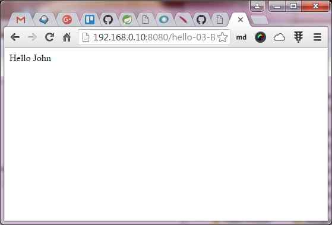
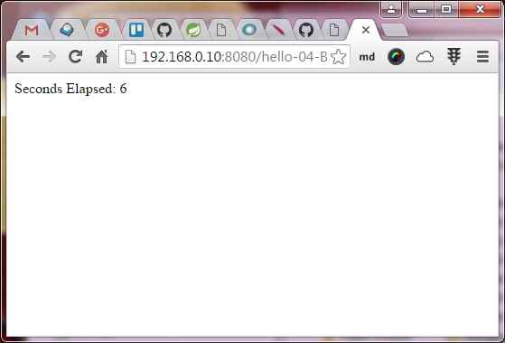
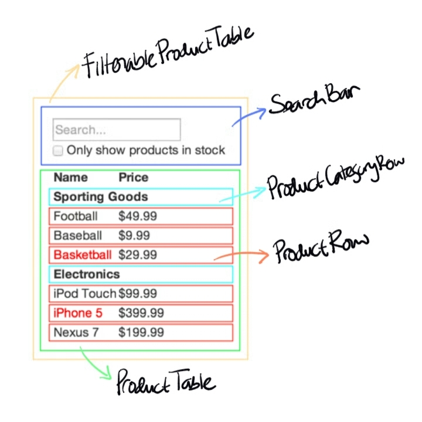
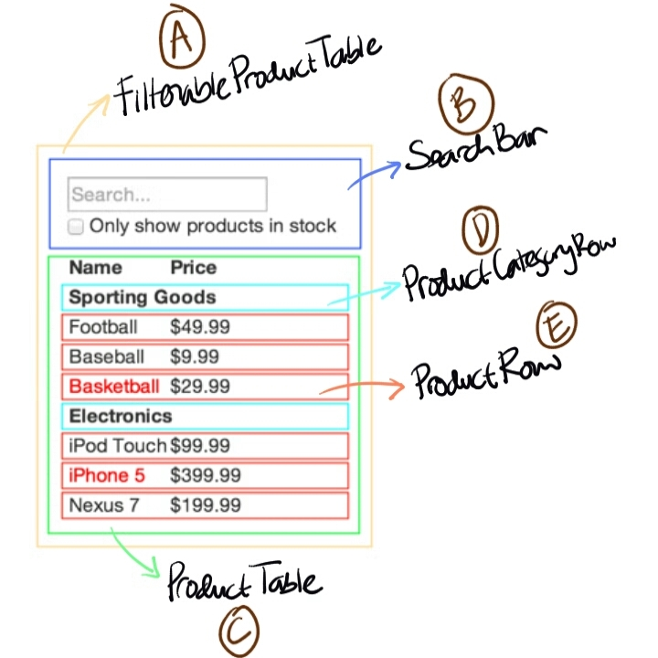
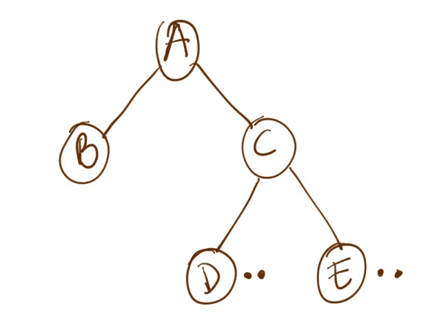
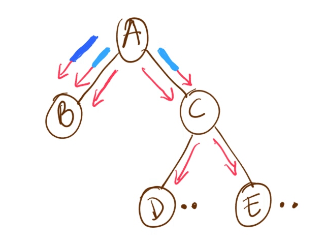
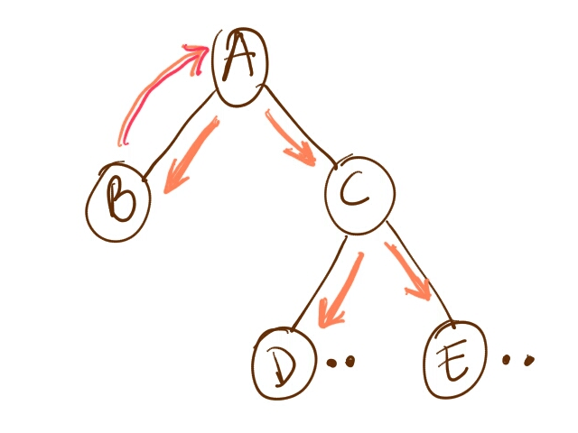
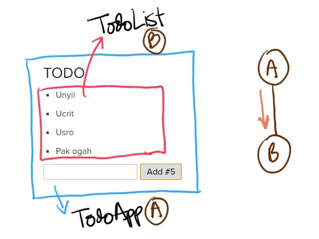
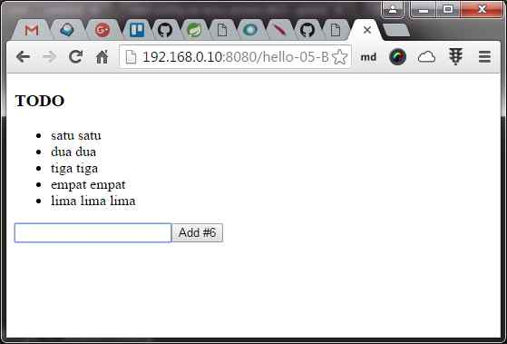
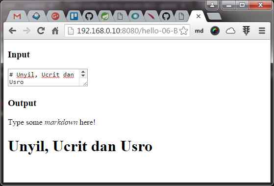

class: split-30 nopadding
background-image: url( bkgs/daun.jpg )

.column_bt.center[.vmiddle.pushfront[
.figplaint[

]
]]
.column_t2.shadelightdark.add-left-border.pushfront[.vmiddle.nopadding[
.boxtitle4[
### Intro &amp; Concept
# Learning React

### [Eueung Mulyana](https://github.com/eueung)
### https://eueung.github.io/112016/react
#### CodeLabs | [Attribution-ShareAlike CC BY-SA](https://creativecommons.org/licenses/by-sa/4.0/)
#### 
]
]]

---
class: column_t1 middle

.fonth4[
.tabtype1.fullwidth[
| Outline   |
|:-------------:|
| Introduction|
| React Basics|
| Thinking in React|
| Examples |
]]

---
class: split-30 nopadding
background-image: url( bkgs/daun.jpg )

.column_t2.center[.vmiddle[
.figplaint[

]
]]
.column_t2[.vmiddle.nopadding[
.shadelightdark[.boxtitle1[
### 
# Introduction

### 
### 
#### [A JavaScript library for building UIs | React](https://facebook.github.io/react/)
#### 
]]
]]

---
class: split-60 nopadding 

.column_t1[.vmiddle.pushfront.right[

React is a JavaScript **library** for creating .uline[user interfaces] by Facebook and Instagram. Many people choose to think of React as the **V** in **MVC**. 

.bluelight["We built React to solve one problem: building .uline[large] applications with **data** that **changes** over time."] 

<hr/>

React is .yellow[**simple**]: simply express how your app should look at any given point in time, and React will .uline[automatically] manage all **UI updates** when your underlying **data changes**.

React is .yellow[**declarative**]: when the data changes, React conceptually hits the "refresh" button, and knows to .uline[only] update the **changed** parts. You don't need to care how those changes are made.

<hr/>

React is all about building .uline[reusable] **components** i.e. with React the .uline[only] thing you do is **build components**. Components are so .uline[encapsulated], thus making .uline[code reuse], .uline[testing], and .uline[separation of concerns] easy.

]]
.column_t2[.vmiddle[

## React - What? Why?

.figplaint[

]

React is a declarative, efficient, and flexible JavaScript library for building user interfaces.


]]

---
class: split-60 nopadding 

.column_t2[.vmiddle.pushfront.right[

.fonth5[**Just the V in MVC**]<br/>
React does one thing very well, it manages updating the state of the view. Because you can just use this, it is Relatively easy to integrate into other frameworks. Basically, React doesn't care about how your application is **architectured**.

.fonth5[**Popularity**]<br/>
Support from some of the largest companies in the valley and a thriving open-source community. Support continues to grow for it every day.

.fonth5[**Server-Side Rendering**]<br/>
Since react is able to represent the DOM virtually, it is able to render app state server side and be able to then take the current UI state and manage it as a SPA after the client has loaded. This allows for better SEO, performance and progressive enhancement.

.fonth5[**Devs Productivity**]<br/>
Because of the large amount of tooling that supports react, and the focus on simplicity in build react components, it can make building large applications much easier for developers.

]]

.column_t1[.vmiddle[

.fonth5[**How does It Work?**]<br/>
1. Maintains a "Virtual DOM"
1. On changes, it creates a diff
1. Applies the changes in batches to the DOM

.fonth5[**Virtual DOM**]<br/>
- Abstracts the DOM and give a simpler programming model and better performance
- Minimizes the repaints focusing only on what has changed

.fonth5[**Data Flow**]<br/>
- One-way reactive data flow
- Much simpler then traditional data binding
- Declarative

Refs: [React Investigation](http://bassettsj.me/react-case-study-presentation/), [React Native](https://speakerdeck.com/marlonandrade/react-native)

]]

---
class: split-60 nopadding 

.column_t2[.vmiddle.pushfront.right[

.fonth5[**Declarative**]<br/>
React makes it painless to create interactive UIs. Design simple views for each state in your application, and React will efficiently update and render just the right components when your data changes. Declarative views make your code more predictable, simpler to understand, and easier to debug.

.fonth5[**Component-Based**]<br/>
Build encapsulated components that manage their own state, then compose them to make complex UIs. Since component logic is written in JavaScript instead of templates, you can easily pass rich data through your app and keep state out of the DOM.

.fonth5[**Learn Once, Write Anywhere**]<br/>
We don't make assumptions about the rest of your technology stack, so you can develop new features in React without rewriting existing code. React can also render on the server using Node and power mobile apps using React Native.

Ref: [facebook/react](https://github.com/facebook/react)

]]

.column_t1[.vmiddle[

.figplaint[

]

]]

---
class: split-60 nopadding 

.column_t2[.vmiddle.pushfront[

## Adding React to an Existing Application

You don't need to rewrite your app to start using React.

We recommend adding React to a small part of your application, such an individual widget, so you can see if it works well for your use case.

While React can be used .uline[without] a **build pipeline**, we recommend setting it up so you can be more productive. A .uline[modern build pipeline] typically consists of:

- A **package manager**, such as .uline[Yarn] or .uline[npm]. It lets you take advantage of a vast ecosystem of third-party packages, and easily install or update them.
- A **bundler**, such as .uline[webpack] or .uline[Browserify]. It lets you write modular code and bundle it together into small packages to optimize load time.
- A **compiler** such as .uline[Babel]. It lets you write modern JavaScript code that still works in older browsers.

Ref: [Installation - React](https://facebook.github.io/react/docs/installation.html)

]]

.column_t1[.vmiddle[

.figplaint[

]

]]

---
class: split-30 nopadding
background-image: url( bkgs/daun.jpg )

.column_t2.center[.vmiddle[
.figplaint[

]
]]
.column_t2[.vmiddle.nopadding[
.shadelightdark[.boxtitle1[
### 
# React Basics

### 
### 
#### 
#### 
]]
]]

---
class: split-40 nopadding 

.column_t1[.vmiddle.pushfront.right[

# Using React

.fonth5[Vanilla JS] <br/>
.bluelight[.fonth5[JSX (+ES2015)]

Transformed @Browser

Precompiled (&amp; bundled)
]
]]
.column_t2[.vmiddle[

## Transformed @Browser

Load React from a CDN

```html
*<script src="https://unpkg.com/react@15/dist/react.min.js"></script>
*<script src="https://unpkg.com/react-dom@15/dist/react-dom.min.js"></script>
<script src="https://unpkg.com/babel-standalone@6.15.0/babel.min.js"></script>
```

]]

---
class: split-40 nopadding 

.column_t1[.vmiddle.pushfront.right[
#JSX

JSX is a syntax extension to JavaScript. We can use it with React to describe what the UI should look like. JSX may remind us of a template language, but it comes with the full power of JavaScript. JSX produces React "elements" (tree nodes).

JSX is not required to use React, but it makes code more readable, and writing it feels like writing HTML. A simple transform is included with React that allows converting JSX into native JavaScript for browsers to digest.

Ref: [Introducing JSX - React](https://facebook.github.io/react/docs/introducing-jsx.html)

]]
.column_t2[.vmiddle[

JSX lets you create JavaScript objects using XML/HTML syntax. To generate a link in React using pure JavaScript you'd write:

```html
React.createElement('a', {href: 'http://facebook.github.io/react/'}, 'Hello!')
```

With JSX this becomes:

```html
<a href="http://facebook.github.io/react/">Hello!</a>
```

We've found this has made building React apps easier and designers tend to prefer the syntax, but everyone has their own workflow, so JSX is not required to use React.

]]

---
class: split-70 nopadding 

.column_t2[.vmiddle[

```html
<!DOCTYPE html>
<html>
  <head>
    <meta charset="UTF-8" />
    <title>Hello React!</title>
*   <script src="https://unpkg.com/react@latest/dist/react.js"></script>
*   <script src="https://unpkg.com/react-dom@latest/dist/react-dom.js"></script>
*   <script src="https://unpkg.com/babel-standalone@6.15.0/babel.min.js"></script>
  </head>
  <body>
    <div id="example"></div>
*   <script type="text/babel">
      ReactDOM.render(
        <h1>Hello, world!</h1>,
        document.getElementById('example')
      );
*   </script>
  </body>
</html>
```

]]
.column_t1[.vmiddle[
### Transformed @Browser

]]

---
class: split-70 nopadding 

.column_t2[.vmiddle[

```html
<!DOCTYPE html>
<html>
  <head>
    <meta charset="UTF-8" />
    <title>Hello React!</title>
*   <script src="https://unpkg.com/react@latest/dist/react.js"></script>
*   <script src="https://unpkg.com/react-dom@latest/dist/react-dom.js"></script>
*   <script src="https://unpkg.com/babel-standalone@6.15.0/babel.min.js"></script>
  </head>
  <body>
    <div id="example"></div>
*   <script type="text/babel" src="src/hello.js"></script>
  </body>
</html>
```

```
ReactDOM.render(
  <h1>Hello, world!</h1>,
  document.getElementById('example')
);
```

]]
.column_t1[.vmiddle[
### Transformed @Browser

]]

---
class: column_t1 middle center 

#Precompile JSX to JS

.align-left[
```bash
npm install -g babel-cli 
*npm install -g babel-preset-react 
npm install -g babel-preset-es2015
```

```bash
*$> babel --presets react hello.js --out-dir=../build
hello.js -> ..\build\hello.js
```
]

---
class: split-70 nopadding 

.column_t2[.vmiddle[

```html
<!DOCTYPE html>
<html>
  <head>
    <meta charset="UTF-8" />
    <title>Hello React!</title>
*   <script src="https://unpkg.com/react@latest/dist/react.js"></script>
*   <script src="https://unpkg.com/react-dom@latest/dist/react-dom.js"></script>
  </head>
  <body>
    <div id="example"></div>
*   <script src="build/hello.js"></script>
  </body>
</html>
```


```javascript
*# src/hello.js (JSX)
ReactDOM.render(
  <h1>Hello, world!</h1>,
  document.getElementById('example')
);
#---

*# build/hello.js (compiled)
ReactDOM.render(React.createElement(
  'h1',
  null,
  'Hello, world!'
), document.getElementById('example'));
```

]]
.column_t1[.vmiddle[
# Precompiled

]]

---
class: split-40 nopadding 

.column_t1[.vmiddle.right[
## .bluelight[this.props]
#### &nbsp;

.figstyle1[

]

]]
.column_t2[.vmiddle[

```html
<!DOCTYPE html>
<html>
  <head>
    <meta charset="UTF-8" />
    <title>Hello React!</title>
*   <script src="https://unpkg.com/react@latest/dist/react.js"></script>
*   <script src="https://unpkg.com/react-dom@latest/dist/react-dom.js"></script>
*   <script src="https://unpkg.com/babel-standalone@6.15.0/babel.min.js"></script>
  </head>
  <body>
    <div id="example"></div>
*   <script type="text/babel" src="src/hello-props.js"></script>
  </body>
</html>
```

```
var HelloMessage = React.createClass({
  render: function() {
*   return <div>Hello {this.props.name}</div>;
  }
});

*ReactDOM.render(<HelloMessage name="John" />, document.getElementById('example'));
```

.center[hello-props.js]

]]

---
class: split-40 nopadding 

.column_t1[.vmiddle.right[

## .bluelight[this.state]
#### &nbsp;

.figstyle1[

]

]]

.column_t2[.vmiddle[

```
var Timer = React.createClass({
  getInitialState: function() {
    return {secondsElapsed: 0};
  },
  tick: function() {
*   this.setState({secondsElapsed: this.state.secondsElapsed + 1});
  },
* componentDidMount: function() {
    this.interval = setInterval(this.tick, 1000);
  },
* componentWillUnmount: function() {
    clearInterval(this.interval);
  },
  render: function() {
    return (
*     <div>Seconds Elapsed: {this.state.secondsElapsed}</div>
    );
  }
});

ReactDOM.render(<Timer />, document.getElementById('example'));

```

.center[hello-state.js]

]]

---
class: split-30 nopadding
background-image: url( bkgs/daun.jpg )

.column_t2.center[.vmiddle[
.figplaint[

]
]]
.column_t2[.vmiddle.nopadding[
.shadelightdark[.boxtitle1[
### 
# Thinking in React

### 
### 
#### 
#### 
]]
]]

---
class: split-40 nopadding 

.column_t1[.vmiddle.right[
# Thinking in React
.fonth5.bluelight[
One of the many great parts of React is how it makes you **think about apps** as you .uline[build] them. ]

In this part, we will walk you through the thought process of building a searchable product data table using React.

Ref: [Thinking in React](https://facebook.github.io/react/docs/thinking-in-react.html)

]]
.column_t2[.vmiddle[
.fonth5[
1. Start with a **Mock**
1. Break the UI into a **Component Hierarchy**
1. Build a **Static Version** in React
1. Identify the .uline[minimal] representation of **UI State**
1. Identify **where** the .uline[state should live]
1. Add .uline[inverse] **data flow**
]
]]

---
class: split-50 nopadding 

.column_t2[.vmiddle.center[
# Step \#1
.figplaint[

]
]]
.column_t1[.vmiddle[
## Data

```json
[
* {
*   category: "Sporting Goods", 
*   price: "$49.99", 
*   stocked: true, 
*   name: "Football"
* },
  {category: "Sporting Goods", price: "$9.99", stocked: true, name: "Baseball"},
  {category: "Sporting Goods", price: "$29.99", stocked: false, name: "Basketball"},
  {category: "Electronics", price: "$99.99", stocked: true, name: "iPod Touch"},
  {category: "Electronics", price: "$399.99", stocked: false, name: "iPhone 5"},
  {category: "Electronics", price: "$199.99", stocked: true, name: "Nexus 7"}
];
```

]]

---
class: split-50 nopadding 

.column_t2[.vmiddle.center[
# Step \#2
.figplaint[

]
]]
.column_t1[.vmiddle[
.figplaint[

]
]]

---
class: split-50 nopadding 

.column_t2[.vmiddle.center[
# Step \#3
.align-left[
```javascript
var PRODUCTS = [
  {category: 'Sporting Goods', price: '$49.99', stocked: true, name: 'Football'},
  {category: 'Sporting Goods', price: '$9.99', stocked: true, name: 'Baseball'},
  {category: 'Sporting Goods', price: '$29.99', stocked: false, name: 'Basketball'},
  {category: 'Electronics', price: '$99.99', stocked: true, name: 'iPod Touch'},
  {category: 'Electronics', price: '$399.99', stocked: false, name: 'iPhone 5'},
  {category: 'Electronics', price: '$199.99', stocked: true, name: 'Nexus 7'}
];
```
]
]]
.column_t1[.vmiddle[
```javascript
*class ProductCategoryRow extends React.Component {
  render() {
    return <tr><th colSpan="2">{this.props.category}</th></tr>;
  }
}

*class ProductRow extends React.Component {
  render() {
    var name = this.props.product.stocked ?
      this.props.product.name :
      <span style={{color: 'red'}}>
        {this.props.product.name}
      </span>;
    return (
      <tr>
        <td>{name}</td>
        <td>{this.props.product.price}</td>
      </tr>
    );
  }
}
```
]]

---
class: split-50 nopadding 

.column_t2[.vmiddle.center[
# Step \#3
.align-left[
```javascript
*class ProductTable extends React.Component {
  render() {
    var rows = [];
    var lastCategory = null;
    this.props.products.forEach(function(product) {
      if (product.category !== lastCategory) {
        rows.push(<ProductCategoryRow category={product.category} key={product.category} />);
      }
      rows.push(<ProductRow product={product} key={product.name} />);
      lastCategory = product.category;
    });
    return (
      <table>
        <thead>
          <tr>
            <th>Name</th>
            <th>Price</th>
          </tr>
        </thead>
        <tbody>{rows}</tbody>
      </table>
    );
  }
}
```
]
]]
.column_t1[.vmiddle[
```javascript
*class SearchBar extends React.Component {
  render() {
    return (
      <form>
        <input type="text" placeholder="Search..." />
        <p>
          <input type="checkbox" />
          {' '}
          Only show products in stock
        </p>
      </form>
    );
  }
}

*class FilterableProductTable extends React.Component {
  render() {
    return (
      <div>
        <SearchBar />
        <ProductTable products={this.props.products} />
      </div>
    );
  }
}

*ReactDOM.render(
  <FilterableProductTable products={PRODUCTS} />,
  document.getElementById('container')
);
```
]]

---
class: split-50 nopadding 

.column_t2[.vmiddle.center[
# Step \#3
.align-left[
**Static Version**: a version that takes your data model and .uline[renders the UI] but has **no interactivity**. It's best to decouple these processes because building a static version requires a .uline[lot of typing and no thinking], and adding **interactivity** requires a .uline[lot of thinking] and not a lot of typing.

Here we want to build components that reuse other components and pass data using **props**. props are a way of passing data from parent to child. 

If you're familiar with the concept of **state**, don't use state at all to build this static version. State is .uline[reserved] only for **interactivity**, that is, data that .uline[changes] over time. 

]
]]
.column_t1[.vmiddle[
### Passing .bluelight[`props`]

```html
<FilterableProductTable products={PRODUCTS} />

<SearchBar />
<ProductTable products={this.props.products} />

*<ProductCategoryRow category={product.category} key={product.category} />
*<ProductRow product={product} key={product.name} />
```
]]

---
class: split-50 nopadding 

.column_t2[.vmiddle.center[
# Step \#4
.align-left[

To make your UI interactive, you need to be able to trigger changes to your underlying data model. React makes this easy with **state**.

To build your app correctly, you first need to think of the .uline[minimal set of mutable] **state** that your app needs.

DRY (Don't Repeat Yourself): Figure out the absolute minimal representation of the state your application needs and **compute** .uline[everything else] you need on-demand. <hr/>

The **original list** of products is passed in as .uline[props], so that's not state. The **search text** and the **checkbox** seem to be state since they .uline[change over time] and .uline[can't be computed] from anything. And finally, the **filtered list** of products isn't state because it .uline[can be computed] by combining the original list of products with the search text and value of the checkbox.

]
]]
.column_t1[.vmiddle[
Think of all of the pieces of data in our example application. We have:
- The original list of products
- .yellow[**The search text the user has entered**]
- .yellow[**The value of the checkbox**]
- The filtered list of products

Then, simply ask three questions about each piece of data:
- .bluelight[Is it passed in from a parent via props?] If so, it probably isn't state.
- .bluelight[Does it remain unchanged over time?] If so, it probably isn't state.
- .bluelight[Can you compute it based on any other state or props in your component?] If so, it isn't state.

]]

---
class: split-60 nopadding 

.column_t2[.vmiddle.center[
# Step \#5
.align-left[
Next, we need to identify which component **mutates**, or .uline[owns], this state.

Remember: React is all about **one-way** data flow .uline[down] the component hierarchy. It may not be immediately clear which component should own what state. This is often the most challenging part for newcomers to understand. <hr/>

For each piece of state in your application:
- Identify .uline[every] component that .uline[renders something] based on that state.
- Find a **common owner** component (a single component .uline[above] all the components that need the state in the hierarchy).
- Either the .uline[common owner] **or** .uline[another component higher up] in the hierarchy should own the state.
- If you .uline[can't find] a component where it makes sense to own the state, .uline[create] a new component simply for holding the state and add it somewhere in the hierarchy .uline[above] the common owner component.
]
]]
.column_t1[.vmiddle[
###Identify Where Your State Should Live
- **ProductTable** needs to filter the product list based on state and **SearchBar** needs to display the search text and checked state.
- The .uline[common owner] component is **FilterableProductTable**.
- It conceptually makes sense for the filter text and checked value to live in **FilterableProductTable**

]]

---
class: split-50 nopadding 

.column_t2[.vmiddle.center[
# Step \#5
.align-left[
```javascript
class FilterableProductTable extends React.Component {
* constructor(props) {
*   super(props);
*   this.state = {
*     filterText: '',
*     inStockOnly: false
*   };
* }

  render() {
    return (
      <div>
        <SearchBar
*         filterText={this.state.filterText}
*         inStockOnly={this.state.inStockOnly}
        />
        <ProductTable
          products={this.props.products}
*         filterText={this.state.filterText}
*         inStockOnly={this.state.inStockOnly}
        />
      </div>
    );
  }
}
```
]
]]
.column_t1[.vmiddle[
```javascript
class SearchBar extends React.Component {
  render() {
    return (
      <form>
*       <input type="text" placeholder="Search..." value={this.props.filterText} />
        <p>
*         <input type="checkbox" checked={this.props.inStockOnly} />
          {' '}
          Only show products in stock
        </p>
      </form>
    );
  }
}
```
]]

---
class: split-40 nopadding 

.column_t2[.vmiddle.center[
# Step \#5
.align-left[
For each product in products:
- if no filter-text matches, always return .uline[empty]
- if there is a match, checkbox is **checked** AND stocked is **false**, return .uline[empty]
- otherwise return .uline[element]
]
]]
.column_t1[.vmiddle[
```javascript
class ProductTable extends React.Component {
  render() {
    var rows = [];
    var lastCategory = null;
    this.props.products.forEach((product) => {
*     if (product.name.indexOf(this.props.filterText) === -1 || (!product.stocked && this.props.inStockOnly)) {
*       return;
*     }
      if (product.category !== lastCategory) {
        rows.push(<ProductCategoryRow category={product.category} key={product.category} />);
      }
      rows.push(<ProductRow product={product} key={product.name} />);
      lastCategory = product.category;
    });
    return (
      <table>
        <thead>
          <tr>
            <th>Name</th>
            <th>Price</th>
          </tr>
        </thead>
        <tbody>{rows}</tbody>
      </table>
    );
  }
}
```
]]


---
class: split-50 nopadding 

.column_t2[.vmiddle.center[
### Step \#6
.align-left[
If you try to type or check the box in the prev. version of the example, you'll see that React **ignores** your input. This is intentional, as we've set the value prop of the input to .uline[always be equal] to the **state** passed in from **FilterableProductTable**.

It renders correctly as a function of .uline[props] and .uline[state] flowing **down** the hierarchy. Now it's time to support data .uline[flowing the other way]: the form components deep in the hierarchy need to update the state in **FilterableProductTable**.

We want to make sure that whenever the user changes the form, we update the state to reflect the user input:
- Since components should only update their own state, **FilterableProductTable** will pass a .uline[callback] to **SearchBar** that will fire whenever the state should be updated. 
- We can use the **onChange** event on the .uline[inputs] to be notified of it. 
- And the .uline[callback] passed by **FilterableProductTable** will call **setState()**, and the app will be updated.

]
]]
.column_t1[.vmiddle[
```javascript
class FilterableProductTable extends React.Component {
  constructor(props) {
    super(props);
    this.state = { filterText: '', inStockOnly: false };
*   this.handleUserInput = this.handleUserInput.bind(this);
  }

* handleUserInput(filterText, inStockOnly) {
*   this.setState({
*     filterText: filterText,
*     inStockOnly: inStockOnly
*   });
* }

  render() {
    return (
      <div>
        <SearchBar
          filterText={this.state.filterText}
          inStockOnly={this.state.inStockOnly}
*         onUserInput={this.handleUserInput}
        />
        <ProductTable
          products={this.props.products}
          filterText={this.state.filterText}
          inStockOnly={this.state.inStockOnly}
        />
      </div>
    );
  }
}
```
]]

---
class: split-50 nopadding 

.column_t2[.vmiddle.center[
# Step \#6
.align-left[
```javascript
class SearchBar extends React.Component {
* constructor(props) {
*   super(props);
*   this.handleChange = this.handleChange.bind(this);
* }
  
* handleChange() {
*   this.props.onUserInput(
*     this.filterTextInput.value,
*     this.inStockOnlyInput.checked
*   );
* }
```  
]
]]
.column_t1[.vmiddle[
```javascript
  #...
  render() {
    return (
      <form>
        <input
          type="text"
          placeholder="Search..."
          value={this.props.filterText}
*         ref={(input) => this.filterTextInput = input}
*         onChange={this.handleChange}
        />
        <p>
          <input
            type="checkbox"
            checked={this.props.inStockOnly}
*           ref={(input) => this.inStockOnlyInput = input}
*           onChange={this.handleChange}
          />
          {' '}
          Only show products in stock
        </p>
      </form>
    );
  }
}
```
]]

---
class: split-50 nopadding 

.column_t1[.vmiddle.right[
### Notes

In the .uline[typical] React dataflow, **props** are the only way that parent components interact with their children. To modify a child, you .uline[re-render] it with .uline[new] props. 

However, there are a few cases where you need to imperatively modify a child outside of the typical dataflow. The child to be modified could be .uline[an instance] of a React component, or it could be .uline[a DOM element]. For both of these cases, React provides an escape hatch.

React supports a special attribute that you can attach to any component. The .yellow[**ref**] attribute takes a .uline[callback] function, and the callback will be executed .uline[immediately] after the component is mounted or unmounted.

When the **ref** attribute is used on an HTML element, the ref .uline[callback] receives the underlying .uline[DOM element] as its argument. In the previous code, the ref callback is used to .uline[store a reference] to a DOM node.

See: [Refs and the DOM](https://facebook.github.io/react/docs/refs-and-the-dom.html)
]]
.column_t2[.vmiddle[
.figplaint[

]
]]

---
class: split-50 nopadding 

.column_t2[.vmiddle.center[
## props, state &amp; callback
.figplaint[

]
]]
.column_t1[.vmiddle.center[
.figplaint[

]
## Final Data Flow
]]

---
class: split-30 nopadding
background-image: url( bkgs/daun.jpg )

.column_t2.center[.vmiddle[
.figplaint[

]
]]
.column_t2[.vmiddle.nopadding[
.shadelightdark[.boxtitle1[
### 
# Examples

### 
### 
#### 
#### 
]]
]]

---
class: split-40 nopadding 

.column_t1[.vmiddle.right[
# TodoApp

This example uses **state** to track the current .uline[list of items] as well as the .uline[text] that the user has entered. 

See: [React Mainpage](https://facebook.github.io/react/)

]]
.column_t2[.vmiddle.center[
.figplaint[

]

]]

---
class: split-50 nopadding 

.column_t2[.vmiddle[

```javascript
*class TodoList extends React.Component {
  render() {
    return (
      <ul>
*       {this.props.items.map(item => (
*         <li key={item.id}>{item.text}</li>
*       ))}
      </ul>
    );
  }
}

ReactDOM.render(<TodoApp />, document.getElementById('example'));

class TodoApp extends React.Component {
  constructor(props) {
    super(props);
*   this.handleChange = this.handleChange.bind(this);
*   this.handleSubmit = this.handleSubmit.bind(this);
*   this.state = {items: [], text: ''};
  }

#...

```
]]
.column_t1[.vmiddle[

```javascript
#...
  render() {
    return (
      <div>
        <h3>TODO</h3>
*       <TodoList items={this.state.items} />
        <form onSubmit={this.handleSubmit}>
          <input onChange={this.handleChange} value={this.state.text} />
          <button>{'Add #' + (this.state.items.length + 1)}</button>
        </form>
      </div>
    );
  }

* handleChange(e) {
    this.setState({text: e.target.value});
  }

* handleSubmit(e) {
    e.preventDefault();
    var newItem = {
      text: this.state.text,
      id: Date.now()
    };
    this.setState((prevState) => ({
      items: prevState.items.concat(newItem),
      text: ''
    }));
  }
}
```

]]

---
class: column_t1 middle 

.figstyle1[

]

.center[TodoApp]

---
class: split-40 nopadding 

.column_t1[.vmiddle.right[
# Notes


]]
.column_t2[.vmiddle[
**Default Behaviour**
To prevent default behavior in React, you must call **preventDefault** explicitly (**e.preventDefault()** - `e` is a synthetic event, compatible with the W3C)

**State Updates May Be Asynchronous**
React may batch multiple `setState()` calls into a .uline[single update] for performance. Because **this.props** and **this.state** may be updated asynchronously, you should not rely on their values for calculating the next state.

```javascript
// Wrong
this.setState({
  counter: this.state.counter + this.props.increment,
});

// Correct
this.setState((prevState, props) => ({
  counter: prevState.counter + props.increment
}));
```

The second form of `setState()` accepts the previous state as the first argument, and the props at the time the update is applied as the second argument.

]]

---
class: split-50 nopadding 

.column_t2[.vmiddle[

```html
<!DOCTYPE html>
<html>
  <head>
    <meta charset="UTF-8" />
    <title>Hello React!</title>
    <script src="https://unpkg.com/react@latest/dist/react.js"></script>
    <script src="https://unpkg.com/react-dom@latest/dist/react-dom.js"></script>
    <script src="https://unpkg.com/babel-standalone@6.15.0/babel.min.js"></script>

*   <script src="https://facebook.github.io/react/js/remarkable.min.js"></script>
  </head>
  <body>
    <div id="example"></div>
    <script type="text/babel" src="src/app.js"></script>
  </body>
</html>
```
.center[app.html]

]]
.column_t1[.vmiddle[
# MarkdownEditor
### A Component Using External Plugins
#### &nbsp;

.figstyle1[

]

]]

---
class: split-50 nopadding 

.column_t1[.vmiddle[
# MardownEditor
## Single Component

```javascript
class MarkdownEditor extends React.Component {
  constructor(props) {
    super(props);
*   this.handleChange = this.handleChange.bind(this);
*   this.state = {value: 'Type some *markdown* here!'};
  }

* handleChange() {
    this.setState({value: this.refs.textarea.value});
  }

```

]]
.column_t2[.vmiddle[
```javascript
#...

* getRawMarkup() {
    var md = new Remarkable();
    return { __html: md.render(this.state.value) };
  }

* render() {
    return (
      <div className="MarkdownEditor">
        <h3>Input</h3>
*       <textarea
*         onChange={this.handleChange}
*         ref="textarea"
*         defaultValue={this.state.value} />
        <h3>Output</h3>
        <div
          className="content"
          dangerouslySetInnerHTML={this.getRawMarkup()}
        />
      </div>
    );
  }
}

ReactDOM.render(<MarkdownEditor />, document.getElementById('example'));
```
]]


---
class: split-30 nopadding
background-image: url( bkgs/daun.jpg )

.column_t2.center[.vmiddle[
.figplaint[

]
]]
.column_t2[.vmiddle.nopadding[
.shadelightdark[.boxtitle1[
### 
# Refs

### 
### 
#### 
#### 
]]
]]

---
# Refs

.fonth5[
1. [A JavaScript library for building user interfaces | React](https://facebook.github.io/react/)
1. [facebook/react: A declarative, efficient, and flexible JavaScript library for building user interfaces.](https://github.com/facebook/react)
1. [Getting Started | React](https://facebook.github.io/react/docs/getting-started.html)
1. [Thinking in React](https://facebook.github.io/react/docs/thinking-in-react.html)
1. [React Investigation](http://bassettsj.me/react-case-study-presentation/)
1. [React Native](https://speakerdeck.com/marlonandrade/react-native)
1. [Why React? | React Prev. Version](http://chenglou.github.io/react/docs/why-react.html)
]

---
class: split-30 nopadding
background-image: url( bkgs/daun.jpg )

.column_bt.center[.vmiddle.pushfront[
.figplaint[

]
]]
.column_t2.shadelightdark.add-left-border.pushfront[.vmiddle.nopadding[
.boxtitle4[
### 
# END

### [Eueung Mulyana](https://github.com/eueung)
### https://eueung.github.io/112016/react
#### CodeLabs | [Attribution-ShareAlike CC BY-SA](https://creativecommons.org/licenses/by-sa/4.0/)
#### 
]
]]

