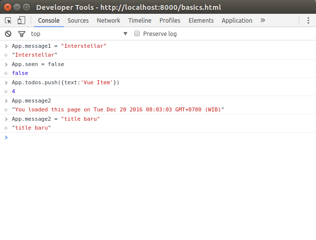

class: split-40 nopadding
background-image: url( bkgs/dauncoklat.jpg )

.column_t2.center[.vmiddle.pushfront[
.figplaint-maxh550.opacity7[

]
]]
.column_t2.shadelightdark.add-left-border.pushfront[.vmiddle.nopadding[
.boxtitle4[
### Introduction - by Examples
# .fsize95[.yellow[Vue.JS]]

### [Eueung Mulyana](https://github.com/eueung)
### https://eueung.github.io/112016/vuejs
#### CodeLabs | [Attribution-ShareAlike CC BY-SA](https://creativecommons.org/licenses/by-sa/4.0/)
#### 
]
]]
---
class: column_t1 middle center

.fonth3[.yellow[**Vue.JS**] Version: **2.1.6**]<br/>.fonth4[.yellow[**Vue Material**] Version: **0.5.1** ]


---
class: column_t1 middle

.fonth4[
.tabtype1.fullwidth[
| Outline   |
|:-------------:|
|Introduction|
|Basic Examples|
|vue-cli|
|Vue Components|


]]

---
class: split-30 nopadding
background-image: url( bkgs/dauncoklat.jpg )

.column_t2.center[.vmiddle[
.figplaint-maxh550.opacity7[

]
]]
.column_t2[.vmiddle.nopadding[
.shadelightdark[.boxtitle1[
### 
# .fsize95[Introduction]

### 
### 
#### 
#### 
]]
]]
---
class: split-60 nopadding 

.column_t1[.vmiddle.pushfront.right[


.fonth5[Vue is a .uline[progressive] framework for building user interfaces. Unlike other monolithic frameworks, Vue is designed from the ground up to be **incrementally** adoptable.]

The core library is focused on the **view** layer only, and is very easy to pick up and .uline[integrate] with other libraries or existing projects. On the other hand, Vue is also perfectly capable of powering sophisticated Single-Page Applications when used in combination with modern tooling and supporting libraries.

Ref: [Vue.JS - Guide](https://vuejs.org/v2/guide/)


]]
.column_t2[.vmiddle.pushfront.center[

#Vue.JS


.figplaint[

]


]]

---
class: split-60 nopadding 

.column_t2[.vmiddle.pushfront.right[


.fonth4.align-left[
**Vue &amp; React**
]
.align-left[
They share many similarities:
- utilize a virtual DOM
- provide reactive and composable view components
- maintain focus in the core library, with concerns such as routing and global state management handled by companion libraries
]

<hr/>.fonth5[
In React, everything is Just JavaScript, which sounds very simple and elegant - until you dig deeper. The unfortunate reality is that reinventing HTML and CSS within JavaScript, while solving some issues of the traditional model, can also cause pain of its own. Vue, instead, utilizes web technologies and build on top of them. Ref: [Comparison](https://vuejs.org/v2/guide/comparison.html).] 


]]
.column_t1[.vmiddle.pushfront.defaultalign[

#.yellow[Deja Vue?]


.fonth5[
Vue has many features that are clearly inspired by other frameworks. This is a good thing; it's great to see new frameworks take some ideas from other libraries and improve on them. 

In particular, you'll see Vue's templating is very close to Angular, but its components and component lifecycle methods are closer to React.
]

Ref: [jfranklin @SitePoint](https://www.sitepoint.com/up-and-running-vue-js-2-0/)


]]

---
class: split-30 nopadding
background-image: url( bkgs/dauncoklat.jpg )

.column_t2.center[.vmiddle[
.figplaint-maxh550.opacity7[

]
]]
.column_t2[.vmiddle.nopadding[
.shadelightdark[.boxtitle1[
### 
# .fsize95[Basic Examples]

### 
### 
#### 
#### 
]]
]]

---
class: split-70 nopadding 

.column_t2[.pushfront.defaultalign[


.fullcode[

```html
<!DOCTYPE html>
<html lang="en">
<head>
  <meta charset="utf-8">
  <title>Vue.JS</title>

* <link rel="stylesheet" href="//fonts.googleapis.com/css?family=Roboto:300,400,500,700,400italic">
* <link rel="stylesheet" href="//fonts.googleapis.com/icon?family=Material+Icons">
* <link rel="stylesheet" href="//unpkg.com/vue-material@latest/dist/vue-material.css">
  <style> .main-content { padding: 16px; } .red { color:red; }</style>
</head>

<body>

<div id="app">
  <md-toolbar> <h1 class="md-title">Learning Vue.JS</h1> </md-toolbar>
  
  <div class="main-content">
*   <h1>{{ message1 }}</h1><h3 class="red">v-on:click</h3>
*   <md-button class="md-raised md-primary" v-on:click="reverseMessage">Reverse</md-button>

    <h3 class="red">v-bind:title</h3><p v-bind:title="message2">123 123 123 123 123</p>
    <h3 class="red">v-if</h3><p v-if="seen">v-if show-hide: Now you see me</p>

*   <h3 class="red">v-for</h3>
*   <ol><li v-for="todo in todos">{{ todo.text }}</li></ol>

    <h1>{{ message3 }}</h1><h3 class="red">v-model</h3>  
    <md-input-container>
      <label>Enter Message</label>
      <md-input v-model="message3"></md-input>
    </md-input-container>

*   <h3 class="red">Component</h3>
*   <ol>
*     <todo-item v-for="item in groceryList" v-bind:todo="item"></todo-item>
*   </ol>

</div></div>

*<script src="//unpkg.com/vue/dist/vue.js"></script>
*<script src="//unpkg.com/vue-material@latest"></script>

<script type="text/javascript">
  Vue.use(VueMaterial)

  Vue.component('todo-item', {
    props: ['todo'],
    template: '<li>{{ todo.text }}</li>'
  })

  var App = new Vue({
*   el: '#app',
*   data: {
      message1: 'Hello Vue.js!',
      message2: 'You loaded this page on ' + new Date(),
      message3: 'Tulis di Form Input..',
      seen: true,
      todos: [
        { text: 'Learn JavaScript' },
        { text: 'Learn Vue' },
        { text: 'Build something awesome' }
      ],
      groceryList: [
        { text: 'Vegetables' },
        { text: 'Cheese' },
        { text: 'Whatever else humans are supposed to eat' }
      ]
    },
*   methods: {
      reverseMessage: function () {
        this.message1 = this.message1.split('').reverse().join('')
      }
    }
  })
</script>
</body></html>
```
]


]]
.column_t1[.vmiddle.pushfront.defaultalign[

#.bluelight[Example \#1]


.fonth5[]
<br/>


]]

---
class: split-70 nopadding bkgpos_00
background-image: url( images/vue-pic-01.png )

.column_t2[.vmiddle.center[

]]
.column_bt[.vmiddle.pushfront.defaultalign[
#Example \#1


]]

---
class: split-70 nopadding bkgpos_00
background-image: url( images/vue-pic-02.png )

.column_t2[.vmiddle.center[

]]
.column_bt[.vmiddle.pushfront.defaultalign[
#Example \#1


]]

---
class: split-70 nopadding 

.column_bt[.vmiddle.pushfront.defaultalign[


.figplaint[

]


]]
.column_t1[.vmiddle.pushfront.defaultalign[

#Example \#1


.fonth5[Interaction via Console]


]]

---
class: split-70 nopadding 

.column_t2[.pushfront.defaultalign[


.fullcode[

```html
<!DOCTYPE html>
<html lang="en">
<head>
  <meta charset="utf-8">
  <title>Vue.JS</title>

  <link rel="stylesheet" href="//fonts.googleapis.com/css?family=Roboto:300,400,500,700,400italic">
  <link rel="stylesheet" href="//fonts.googleapis.com/icon?family=Material+Icons">
  <link rel="stylesheet" href="//unpkg.com/vue-material@latest/dist/vue-material.css">
  <style> 
    .main-content { padding: 16px; } .red { color:red;} 
    ul {padding-left:0;} 
*   li {list-style:none; line-height: 40px;} 
    .md-button {margin-left:0;}
  </style>
</head>

<body>

<div id="app">
  <md-toolbar> <h1 class="md-title">Learning Vue.JS</h1> </md-toolbar>
  
  <div class="main-content">
*   <md-input-container>
*     <label>Enter Todo</label>
*     <md-input v-model="newTodo"></md-input>
*   </md-input-container>
*   <md-button class="md-raised md-primary" v-on:click="addTodo">Add Todo</md-button>

    <ul>
*     <li v-for="(todo, index) in todos">
*       <md-button class="md-icon-button md-warn" v-on:click="removeTodo(index)"><md-icon>remove_circle_outline</md-icon></md-button>
*       {{ todo.text }}
*     </li>
    </ul>

</div></div>

<script src="//unpkg.com/vue/dist/vue.js"></script>
<script src="//unpkg.com/vue-material@latest"></script>

<script type="text/javascript">
  Vue.use(VueMaterial)

  var App = new Vue({
*   el: '#app',
*   data: {
      newTodo: '',
      todos: [ { text: 'Add some todos' } ]
    },
*   methods: {
*     addTodo: function () {
        var text = this.newTodo.trim();
        console.log(text);
        if (text) { this.todos.push({ text: text }); this.newTodo = ''; }
      },
*     removeTodo: function (index) { this.todos.splice(index, 1); }
    }
  })
</script>
</body></html>
```
]


]]
.column_t1[.vmiddle.pushfront.defaultalign[

#.bluelight[Example \#2a]


.fonth5[]
<br/>


]]

---
class: split-40 nopadding bkgpos_00
background-image: url( images/vue-pic-04.png )

.column_t2.center[.vmiddle[

]]
.column_t2[.vmiddle.nopadding[
.shadelightdark[.boxtitle1.noborder[
### 
# .fonth5.yellow[Example \#2a]

### 
### 
#### 
#### 
]]
]]
---
class: split-70 nopadding 

.column_t2[.pushfront.defaultalign[


.fullcode[

```html
<!DOCTYPE html>
<html lang="en">
<head>
  <meta charset="utf-8">
  <title>Vue.JS</title>

  <link rel="stylesheet" href="//fonts.googleapis.com/css?family=Roboto:300,400,500,700,400italic">
  <link rel="stylesheet" href="//fonts.googleapis.com/icon?family=Material+Icons">
  <link rel="stylesheet" href="//unpkg.com/vue-material@latest/dist/vue-material.css">
  <style> 
    .main-content { padding: 16px; } .red { color:red;} 
    ul {padding-left:0;} 
    li {list-style:none; line-height: 40px;} 
    .md-button {margin-left:0;}
  </style>
</head>

<body>

<div id="app">
  <md-toolbar> <h1 class="md-title">Learning Vue.JS</h1> </md-toolbar>
  
  <div class="main-content">
    <md-input-container>
      <label>Enter Todo</label>
*     <md-input v-model="newTodoText" placeholder="Add a todo"></md-input>
    </md-input-container>
    <md-button class="md-raised md-primary" v-on:click="addNewTodo">Add Todo</md-button>

    <ul>
*     <li
*       is="todo-item"
*       v-for="(todo, index) in todos"
*       v-bind:title="todo"
*       v-on:remove="todos.splice(index, 1)">
*     </li>
    </ul>

</div></div>

<script src="//unpkg.com/vue/dist/vue.js"></script>
<script src="//unpkg.com/vue-material@latest"></script>

<script type="text/javascript">
  Vue.use(VueMaterial)

* Vue.component('todo-item', {
*   template: '\
*     <li>\
*       {{ title }}\
*       <md-button class="md-icon-button md-warn" v-on:click="$emit(\'remove\')"><md-icon>remove_circle_outline</md-icon></md-button>\
*     </li>\
*   ',
*   props: ['title']
* })
  
  new Vue({
    el: '#app',
    data: {
      newTodoText: '',
      todos: [
        'Do the dishes',
        'Take out the trash',
        'Mow the lawn'
      ]
    },
    methods: {
      addNewTodo: function () {
        this.todos.push(this.newTodoText)
        this.newTodoText = ''
      }
    }
  })
</script>
</body></html>
```
]


]]
.column_t1[.vmiddle.pushfront.defaultalign[

#.bluelight[Example \#2b]


.fonth5[Vue Component<br/>Event]
<br/>


]]

---
class: split-40 nopadding bkgpos_00
background-image: url( images/vue-pic-05.png )

.column_t2.center[.vmiddle[

]]
.column_t2[.vmiddle.nopadding[
.shadelightdark[.boxtitle1.noborder[
### 
# .fonth5.yellow[Example \#2b]

### 
### 
#### 
#### 
]]
]]
---
class: split-30 nopadding
background-image: url( bkgs/dauncoklat.jpg )

.column_t2.center[.vmiddle[
.figplaint-maxh550.opacity7[

]
]]
.column_t2[.vmiddle.nopadding[
.shadelightdark[.boxtitle1[
### 
# .fsize95[vue-cli]

### 
### 
#### 
#### 
]]
]]
---
class: split-40 nopadding 

.column_t1[.vmiddle.pushfront.right[

#Install &amp; Scaffold


]]
.column_t2[.vmiddle.pushfront.defaultalign[


```bash
*$ sudo npm install -g vue-cli

*$ vue init webpack-simple myproj

  This will install Vue 2.x version of template.

  For Vue 1.x use: vue init webpack-simple#1.0 myproj

? Project name myproj
? Project description A Vue.js project
? Author EM

   vue-cli . Generated "myproj".

   To get started:
   
     cd myproj
     npm install
     npm run dev

*myproj$ tree
.
|-- index.html
|-- package.json
|-- README.md
|-- src
|   |-- App.vue
|   |-- assets
|   |   |-- logo.png
|   |-- main.js
|-- webpack.config.js

2 directories, 7 files
```


]]

---
class: split-40 nopadding 

.column_t1[.vmiddle.pushfront.right[

#package.json


]]
.column_t2[.vmiddle.pushfront.defaultalign[


```json
*myproj$ cat package.json 
{
  "name": "myproj",
  "description": "A Vue.js project",
  "version": "1.0.0",
  "author": "EM",
  "private": true,
  "scripts": {
*   "dev": "cross-env NODE_ENV=development webpack-dev-server --open --inline --hot -host 0.0.0.0",
*   "build": "cross-env NODE_ENV=production webpack --progress --hide-modules"
  },
  "dependencies": {
    "vue": "^2.1.0"
  },
  "devDependencies": {
    "babel-core": "^6.0.0",
    "babel-loader": "^6.0.0",
    "babel-preset-es2015": "^6.0.0",
    "cross-env": "^3.0.0",
    "css-loader": "^0.25.0",
    "file-loader": "^0.9.0",
    "vue-loader": "^10.0.0",
    "vue-template-compiler": "^2.1.0",
    "webpack": "^2.1.0-beta.25",
    "webpack-dev-server": "^2.1.0-beta.9"
  }
}
```


]]

---
class: split-40 nopadding 

.column_t1[.vmiddle.pushfront.right[

#Install &amp; Run


]]
.column_t2[.vmiddle.pushfront.defaultalign[


```bash
*myproj$ npm install
*myproj$ npm run dev
> myproj@1.0.0 dev /home/em/vuedir/myproj
> cross-env NODE_ENV=development webpack-dev-server --open --inline --hot --host 0.0.0.0

Project is running at http://0.0.0.0:8080/
webpack output is served from /dist/
404s will fallback to /index.html

*myproj$ npm run build
```


]]

---
class: bkgpos_00 nopadding
background-image: url(images/vue-pic-06.png)

.shadelightdark.bottom_abs[.boxtitle1.noborder.center[
#vue init webpack-simple
]]
---
class: split-70 nopadding 

.column_t2[.pushfront.defaultalign[


.fullcode[

```html
*# index.html
<!DOCTYPE html>
<html lang="en">
  <head>
    <meta charset="utf-8">
    <title>myproj</title>
  </head>
  <body>
    <div id="app"></div>
    <script src="/dist/build.js"></script>
  </body>
</html>

*# App.vue
*<template>
  <div id="app">
    
    <h1>{{ msg }}</h1>
    <h2>Essential Links</h2>
    <ul>
      <li><a href="https://vuejs.org" target="_blank">Core Docs</a></li>
      <li>...</li>
    </ul>
    <h2>Ecosystem</h2>
    <ul>
      <li><a href="http://router.vuejs.org/" target="_blank">vue-router</a></li>
      <li>...</li>
    </ul>
  </div>
*</template>

*<script>
export default {
  name: 'app',
  data () {
    return {
      msg: 'Welcome to Your Vue.js App'
    }
  }
}
*</script>

*<style>
#app {
  font-family: 'Avenir', Helvetica, Arial, sans-serif;
  -webkit-font-smoothing: antialiased;
  -moz-osx-font-smoothing: grayscale;
  text-align: center;
  color: #2c3e50;
  margin-top: 60px;
}

h1, h2 {
  font-weight: normal;
}

ul {
  list-style-type: none;
  padding: 0;
}

li {
  display: inline-block;
  margin: 0 10px;
}

a {
  color: #42b983;
}
*</style>

*# main.js
import Vue from 'vue'
import App from './App.vue'

new Vue({
  el: '#app',
  render: h => h(App)
})
```
]


]]
.column_t1[.vmiddle.pushfront.defaultalign[

#webpack-simple


.fonth5[index.html<br/>App.vue<br/>main.js]
<br/>


]]

---
class: split-40 nopadding 

.column_t1[.vmiddle.pushfront.right[

#Example \#2a Recycled


]]
.column_t2[.vmiddle.pushfront.defaultalign[


```bash
*$ npm install
*$ npm install --save vue-material

*$ tree 
.
*|-- dist
*|   |-- build.js
|-- index.html
|-- package.json
|-- README.md
|-- src
|   |-- App.vue
|   |-- css
|   |   |-- app.css
|   |-- main.js
*|-- webpack.config.js

*$ npm run build
*$ npm run dev
```


]]

---
class: split-40 nopadding 

.column_t1[.vmiddle.pushfront.right[

#package.json


#webpack.config.js


]]
.column_t2[.vmiddle.pushfront.defaultalign[


```json
*$ cat package.json 
{
  ...
  "dependencies": {
    "vue": "^2.1.0",
*   "vue-material": "^0.5.1"
  },
  ...
}

*$ cat webpack.config.js
  module: {
    rules: [
      ...
*     {
*       test: /\.css$/,
*       loader: 'vue-style-loader!css-loader'
*     },
      ...
    ],
   }
 ... 
```


]]

---
class: split-70 nopadding 

.column_t2[.pushfront.defaultalign[


.fullcode[

```html
<!DOCTYPE html>
<html lang="en">
  <head>
    <meta charset="utf-8">
*   <link rel="stylesheet" href="//fonts.googleapis.com/css?family=Roboto:300,400,500,700,400italic">
*   <link rel="stylesheet" href="//fonts.googleapis.com/icon?family=Material+Icons">

    <title>myproj</title>
  </head>
  <body>
    <div id="app"></div>
    <script src="/dist/build.js"></script>
  </body>
</html>

*# -------------------

.main-content { padding: 16px; } .red { color:red;} 
ul {padding-left:0;} 
li {list-style:none; line-height: 40px;} 
.md-button {margin-left:0;}

```
]


]]
.column_t1[.vmiddle.pushfront.defaultalign[

#Example \#2a


.fonth5[**index.html**<br/>src/css/**app.css**]
<br/>


]]

---
class: split-70 nopadding 

.column_t2[.pushfront.defaultalign[


.fullcode[

```javascript
import Vue from 'vue'
import App from './App.vue'
*import VueMaterial from 'vue-material'
import 'vue-material/dist/vue-material.css'
import './css/app.css'

*Vue.use(VueMaterial)

new Vue({
  el: '#app',
  render: h => h(App)
})

/* --------------------------- */

*<template>
<div id="app">
  <md-toolbar> <h1 class="md-title">Learning Vue.JS</h1> </md-toolbar>
  
  <div class="main-content">
*   <md-input-container>
*     <label>Enter Todo</label>
*     <md-input v-model="newTodo"></md-input>
*   </md-input-container>
*   <md-button class="md-raised md-primary" v-on:click="addTodo">Add Todo</md-button>

    <ul>
*     <li v-for="(todo, index) in todos"> 
*       <md-button class="md-icon-button md-warn" v-on:click="removeTodo(index)"><md-icon>remove_circle_outline</md-icon></md-button>
*       {{ todo.text }}
      </li>
    </ul>
</div></div>
*</template>

*<script>
export default {
  name: 'app',
* data () {
    return {
      newTodo: '',
      todos: [ { text: 'Add some todos' } ]
    }
  },
* methods : {
      addTodo: function () {
        var text = this.newTodo.trim();
        console.log(text);
        if (text) { this.todos.push({ text: text }); this.newTodo = ''; }
      },
      removeTodo: function (index) { this.todos.splice(index, 1); }
  }
}
*</script>

```
]


]]
.column_t1[.vmiddle.pushfront.defaultalign[

#Example \#2a


.fonth5[**main.js**<br/>src/**App.vue**]
<br/>


]]

---
class: bkgpos_00 nopadding
background-image: url(images/vue-pic-07.png)

.shadelightdark.bottom_abs[.boxtitle1.noborder.center[
#Example \#2a (webpack)
]]
---
class: split-30 nopadding
background-image: url( bkgs/dauncoklat.jpg )

.column_t2.center[.vmiddle[
.figplaint-maxh550.opacity7[

]
]]
.column_t2[.vmiddle.nopadding[
.shadelightdark[.boxtitle1[
### 
# .fsize95[Vue Components]

### 
### 
#### 
#### 
]]
]]
---
class: split-40 nopadding 

.column_t1[.vmiddle.pushfront.right[

#Example \#3


]]
.column_t2[.vmiddle.pushfront.defaultalign[


.fonth4.blue[Example **\#3a**]

.fonth5[Based on an Article @SitePoint by [Jack Franklin](https://www.sitepoint.com/up-and-running-vue-js-2-0/)<br/>Components are re-organized to a single `index.vue`]

.fonth4.blue[Example **\#3b**]

.fonth5[Example **\#3a** + Vue Material]


]]

---
class: split-40 nopadding 

.column_t1[.vmiddle.pushfront.right[

#Example \#3a


#Structure 


]]
.column_t2[.vmiddle.pushfront.defaultalign[


```bash
*$ tree
.
|-- build
|   |-- main.js
|-- index.html
|-- package.json
|-- src
*|   |-- App
|   |   |-- index.vue
|   |-- bus.js
*|   |-- GithubInput
|   |   |-- index.vue
*|   |-- GithubOutput
|   |   |-- index.vue
*|   |-- GithubUserData
|   |   |-- index.vue
|   |-- main.js
|-- webpack.config.js

6 directories, 10 files

```


]]

---
class: split-70 nopadding 

.column_t2[.pushfront.defaultalign[


.fullcode[

```javascript
{
  "name": "vue2-intro-code",
  "version": "1.0.0",
  "description": "",
  "main": "index.js",
  "scripts": {
    "start": "live-server",
    "build": "webpack --watch"
  },
  "keywords": [],
  "author": "",
  "license": "ISC",
  "devDependencies": {
    "babel-core": "6.18.2",
    "babel-loader": "6.2.7",
    "babel-preset-es2015": "6.18.0",
    "css-loader": "0.25.0",
    "live-server": "1.1.0",
*   "vue": "2.1.6",
*   "vue-loader": "10.0.0",
*   "vue-template-compiler": "^2.1.0",
*   "webpack": "1.13.3"
  }
}

/* --------------------------- */

module.exports = {
* entry: './src/main',
  output: {
*   path: './build',
*   filename: 'main.js',
  },
  module: {
    loaders: [
      {
        test: /\.vue$/,
        loader: 'vue',
      },
      {
        test: /\.js$/,
        loader: 'babel',
        exclude: /node_modules/,
      },
    ],
  },
  vue: {
    loaders: {
      js: 'babel',
    },
  },
}

/* --------------------------- */

<!DOCTYPE html>
<html>
  <head>
    <title>My Vue App</title>
  </head>
  <body>
    <div id="app">
    </div>
    <script src="/build/main.js"></script>
  </body>
</html>
```
]


]]
.column_t1[.vmiddle.pushfront.defaultalign[

#Example \#3a


.fonth5[**package.json**<br/>**webpack.config.js**<br/>**index.html**]
<br/>


]]


---
class: split-70 nopadding 

.column_t2[.vmiddle.pushfront.defaultalign[


```javascript
import Vue from 'vue'

*import AppComponent from './App/index.vue'

const vm = new Vue({
  el: '#app',
  components: {
*   app: AppComponent,
  },
* render: h => h('app'),
})

/* --------------------------- */

import Vue from 'vue'

const bus = new Vue()

export default bus

```


]]
.column_t1[.vmiddle.pushfront.defaultalign[

#Example \#3a


.fonth5[src/**main.js**<br/>src/**bus.js**]
<br/>


]]


---
class: split-70 nopadding 

.column_t2[.pushfront.defaultalign[


.fullcode[

```javascript

*<template>
<div>
  <p>Enter your username to get some Github stats!</p>
  <github-input></github-input>
  <github-output></github-output>
</div>
*</template>

*<script>
import GithubInput from '../GithubInput/index.vue'
import GithubOutput from '../GithubOutput/index.vue'

export default {
  name: 'App',
  components: {
    'github-input': GithubInput,
    'github-output': GithubOutput,
  },
  data() {
    return {}
  },
}
*</script>

*<style scoped>
p {
  color: red;
}
*</style>
```
]


]]
.column_t1[.vmiddle.pushfront.defaultalign[

#Example \#3a


.fonth5[src/**App**/index.vue]
<br/>


]]


---
class: split-70 nopadding 

.column_t2[.pushfront.defaultalign[


.fullcode[

```javascript
*<template>
<form v-on:submit.prevent="onSubmit">
  <input type="text" v-model="username" placeholder="Enter a github username here" />
  <button type="submit">Go!</button>
</form>
*</template>

*<script>
import bus from '../bus'

export default {
  name: 'GithubInput',
  methods: {
    onSubmit(event) {
      if (this.username && this.username !== '') {
        bus.$emit('new-username', this.username)
      }
    }
  },
  data() {
    return {
      username: '',
    }
  }
}
*</script>

```
]


]]
.column_t1[.vmiddle.pushfront.defaultalign[

#Example \#3a


.fonth5[]
<br/>src/**GithubInput**/index.vue


]]

---
class: split-70 nopadding 

.column_t2[.pushfront.defaultalign[


.fullcode[

```javascript
*<template>
<div>
  <p v-if="currentUsername == null">
    Enter a username above to see their Github data
  </p>
  <p v-else>
    Below are the results for {{ currentUsername }}:
*   <github-user-data :data="githubData[currentUsername]"></github-user-data>
  </p>
</div>
*</template>

*<script>
import bus from '../bus'
import Vue from 'vue'
*import GithubUserData from '../GithubUserData/index.vue'

export default {
  name: 'GithubOutput',
  components: {
    'github-user-data': GithubUserData,
  },
* created() {
    bus.$on('new-username', this.onUsernameChange)
  },
* destroyed() {
    bus.$off('new-username', this.onUsernameChange)
  },
* methods: {
    onUsernameChange(name) {
      this.currentUsername = name
      this.fetchGithubData(name)
    },
    fetchGithubData(name) {
      if (this.githubData.hasOwnProperty(name)) return

      const url = `https://api.github.com/users/${name}`
      fetch(url).then(r => r.json()).then(data => {
        Vue.set(this.githubData, name, data)
        console.log(JSON.stringify(this.githubData))
      })
    }
  },
* data() {
    return {
      currentUsername: null,
      githubData: {}
    }
  }
}
</script>
```
]


]]
.column_t1[.vmiddle.pushfront.defaultalign[

#Example \#3a


.fonth5[]
<br/>src/**GithubOutput**/index.vue


]]


---
class: split-70 nopadding 

.column_t2[.vmiddle.pushfront.defaultalign[


```javascript
*<template>
<div v-if="data">
  <h4>{{ data.name }}</h4>
  <p>{{ data.company }}</p>
  <p>Number of repos: {{ data.public_repos }}
</div>
*</template>

*<script>
export default {
  name: 'GithubUserData',
  props: ['data'],
  data() {
    return {}
  }
}
*</script>
```


]]
.column_t1[.vmiddle.pushfront.defaultalign[

#Example \#3a


.fonth5[****<br/>****]
<br/>src/**GithubUserData**/index.vue


]]


---
class: bkgpos_00 nopadding
background-image: url(images/vue-pic-11.png)

.shadelightdark.bottom_abs[.boxtitle1.noborder.center[
#Example \#3a
]]
---
class: bkgpos_00 nopadding
background-image: url(images/vue-pic-08.png)

.shadelightdark.bottom_abs[.boxtitle1.noborder.center[
#Example \#3a
]]
---
class: split-40 nopadding 

.column_t1[.vmiddle.pushfront.right[

#Example \#3b


#Structure 


]]
.column_t2[.vmiddle.pushfront.defaultalign[


```bash
*$ tree
.
*|-- dist
*|   |-- build.js
*|   |-- build.js.map
|-- index.html
|-- package.json
|-- src
|   |-- App
|   |   |-- index.vue
|   |-- bus.js
*|   |-- css
*|   |   |-- app.css
|   |-- GithubInput
|   |   |-- index.vue
|   |-- GithubOutput
|   |   |-- index.vue
|   |-- GithubUserData
|   |   |-- index.vue
|   |-- main.js
|-- webpack.config.js

7 directories, 12 files

```


]]

---
class: split-70 nopadding 

.column_t2[.pushfront.defaultalign[


.fullcode[

```javascript

{
  "name": "myproj",
  "description": "A Vue.js project",
  "version": "1.0.0",
  "author": "EM",
  "private": true,
  "scripts": {
    "dev": "cross-env NODE_ENV=development webpack-dev-server --open --inline --hot --host 0.0.0.0",
    "build": "cross-env NODE_ENV=production webpack --progress --hide-modules"
  },
  "dependencies": {
    "vue": "^2.1.0",
    "vue-material": "^0.5.1"
  },
  "devDependencies": {
    "babel-core": "^6.0.0",
    "babel-loader": "^6.0.0",
    "babel-preset-es2015": "^6.0.0",
    "cross-env": "^3.0.0",
    "css-loader": "^0.25.0",
    "file-loader": "^0.9.0",
    "vue-loader": "^10.0.0",
    "vue-template-compiler": "^2.1.0",
*   "webpack": "^2.1.0-beta.25",
    "webpack-dev-server": "^2.1.0-beta.9"
  }
}

```
]


]]
.column_t1[.vmiddle.pushfront.defaultalign[

#Example \#3b


.fonth5[**package.json**<br/>]
<br/>


]]


---
class: split-70 nopadding 

.column_t2[.pushfront.defaultalign[


.fullcode[

```javascript
var path = require('path')
var webpack = require('webpack')

module.exports = {
* entry: './src/main.js',
* output: {
    path: path.resolve(__dirname, './dist'),
*   publicPath: '/dist/',
*   filename: 'build.js'
  },
  module: {
    rules: [
      {
        test: /\.vue$/,
        loader: 'vue-loader',
        options: {
          loaders: {
            // Since sass-loader (weirdly) has SCSS as its default parse mode, we map
            // the "scss" and "sass" values for the lang attribute to the right configs here.
            // other preprocessors should work out of the box, no loader config like this nessessary.
            'scss': 'vue-style-loader!css-loader!sass-loader',
            'sass': 'vue-style-loader!css-loader!sass-loader?indentedSyntax'
          }
          // other vue-loader options go here
        }
      },
*     {
*       test: /\.css$/,
*       loader: 'vue-style-loader!css-loader'
*     },
      {
        test: /\.js$/,
        loader: 'babel-loader',
        exclude: /node_modules/
      },
      {
        test: /\.(png|jpg|gif|svg)$/,
        loader: 'file-loader',
        options: {
          name: '[name].[ext]?[hash]'
        }
      }
    ]
  },
  resolve: {
    alias: {
      'vue$': 'vue/dist/vue.common.js'
    }
  },
  devServer: {
    historyApiFallback: true,
    noInfo: true
  },
  performance: {
    hints: false
  },
  devtool: '#eval-source-map'
}

if (process.env.NODE_ENV === 'production') {
  module.exports.devtool = '#source-map'
  // http://vue-loader.vuejs.org/en/workflow/production.html
  module.exports.plugins = (module.exports.plugins || []).concat([
    new webpack.DefinePlugin({
      'process.env': {
        NODE_ENV: '"production"'
      }
    }),
    new webpack.optimize.UglifyJsPlugin({
      sourceMap: true,
      compress: {
        warnings: false
      }
    }),
    new webpack.LoaderOptionsPlugin({
      minimize: true
    })
  ])
}
```
]


]]
.column_t1[.vmiddle.pushfront.defaultalign[

#Example \#3b


.fonth5[**webpack.config.js**<br/>]
<br/>


]]

---
class: split-70 nopadding 

.column_t2[.pushfront.defaultalign[


.fullcode[

```html
<!DOCTYPE html>
<html lang="en">
  <head>
    <meta charset="utf-8">
*   <link rel="stylesheet" href="//fonts.googleapis.com/css?family=Roboto:300,400,500,700,400italic">
*   <link rel="stylesheet" href="//fonts.googleapis.com/icon?family=Material+Icons">

    <title>myproj</title>
  </head>
  <body>
    <div id="app"></div>
    <script src="/dist/build.js"></script>
  </body>
</html>

/* --------------------------- */
import Vue from 'vue'

import AppComponent from './App/index.vue'
*import VueMaterial from 'vue-material'
*import 'vue-material/dist/vue-material.css'
*import './css/app.css'

*Vue.use(VueMaterial)

const vm = new Vue({
  el: '#app',
  components: {
    app: AppComponent,
  },
  render: h => h('app'),
})

/* --------------------------- */
.main-content { padding: 16px; } .red { color:red;} 
ul {padding-left:0;} 
li {list-style:none; line-height: 40px;} 
.md-button {margin-left:0;}
```
]


]]
.column_t1[.vmiddle.pushfront.defaultalign[

#Example \#3b


.fonth5[**index.html**<br/>src/**main.js**<br/>src/css/app.css]
<br/>


]]

---
class: split-70 nopadding 

.column_t2[.pushfront.defaultalign[


.fullcode[

```javascript
*<template>
<div id="app">
* <md-toolbar> <h1 class="md-title">Learning Vue.JS</h1> </md-toolbar> 
* <div class="main-content">

  <p>Enter your username to get some Github stats!</p>
  <github-input></github-input>
  <github-output></github-output>

</div></div>
*</template>

<script>
import GithubInput from '../GithubInput/index.vue'
import GithubOutput from '../GithubOutput/index.vue'

export default {
  name: 'App',
  components: {
    'github-input': GithubInput,
    'github-output': GithubOutput,
  },
  data() {
    return {}
  },
}
</script>

<style scoped>
p {
  color: red;
}
</style>
```
]


]]
.column_t1[.vmiddle.pushfront.defaultalign[

#Example \#3b


.fonth5[src/**App**/index.vue]
<br/>


]]


---
class: split-70 nopadding 

.column_t2[.pushfront.defaultalign[


.fullcode[

```javascript
*<template>
<div>
*   <md-input-container>
*     <label>Github User</label>
*     <md-input v-model="username" placeholder="Enter a github username here"></md-input>
*   </md-input-container>
*   <md-button class="md-raised md-primary" v-on:click="onSubmit">Go!</md-button>
</div>
*</template>

<script>
import bus from '../bus'

export default {
  name: 'GithubInput',
  methods: {
    onSubmit(event) {
      if (this.username && this.username !== '') {
        bus.$emit('new-username', this.username)
      }
    }
  },
  data() {
    return {
      username: '',
    }
  }
}
</script>
```
]


]]
.column_t1[.vmiddle.pushfront.defaultalign[

#Example \#3b


.fonth5[]
<br/>src/**GithubInput**/index.vue


]]

---
class: bkgpos_00 nopadding
background-image: url(images/vue-pic-09.png)

.shadelightdark.bottom_abs[.boxtitle1.noborder.center[
#Example \#3b
]]

---
class: bkgpos_00 nopadding
background-image: url(images/vue-pic-10.png)

.shadelightdark.bottom_abs[.boxtitle1.noborder.center[
#Example \#3b
]]

---
class: split-30 nopadding
background-image: url( bkgs/dauncoklat.jpg )

.column_t2.center[.vmiddle[
.figplaint-maxh550.opacity7[

]
]]
.column_t2[.vmiddle.nopadding[
.shadelightdark[.boxtitle1[
### 
# .fsize95[Refs]

### 
### 
#### 
#### 
]]
]]
---
# Refs

.fonth5[
1. [vuejs.org](https://vuejs.org/)
1. [vuejs/vue: Simple yet powerful library for building modern web interfaces.](https://github.com/vuejs/vue)
1. [Comparison with Other Frameworks - vue.js](https://vuejs.org/v2/guide/comparison.html)
1. [Introduction - Vue Material](https://vuematerial.github.io/)
1. [Getting up and Running with the Vue.js 2.0 Framework](https://www.sitepoint.com/up-and-running-vue-js-2-0/)
1. [jackfranklin/vue2-demo-proj](https://github.com/jackfranklin/vue2-demo-proj)
]


---
class: split-40 nopadding
background-image: url( bkgs/dauncoklat.jpg )

.column_t2.center[.vmiddle.pushfront[
.figplaint-maxh550.opacity7[

]
]]
.column_t2.shadelightdark.add-left-border.pushfront[.vmiddle.nopadding[
.boxtitle4[
### 
# .fsize95[END]

### [Eueung Mulyana](https://github.com/eueung)
### https://eueung.github.io/112016/vuejs
#### CodeLabs | [Attribution-ShareAlike CC BY-SA](https://creativecommons.org/licenses/by-sa/4.0/)
#### 
]
]]


